# SkillSync — Use Case Analysis

> **Version:** 1.0 | **Date:** May 2026 | **Status:** Production

---

## 1. Actor Identification

### 1.1 Primary Actors (Human)

| Actor | Description | Entry Points |
|-------|-------------|--------------|
| **Learner** | Registered user seeking skill development; books sessions, joins groups, submits reviews, processes payments | Register → OTP Verify → Browse Mentors |
| **Mentor** | Approved expert who offers 1:1 sessions; manages availability and accepts/rejects bookings | Apply → Admin Approval → Manage Profile |
| **Admin** | Platform operator with elevated privileges; moderates users, approves mentors, oversees system health | Direct role assignment in Auth Service |

### 1.2 Secondary Actors (External Systems)

| Actor | Role |
|-------|------|
| **Google OAuth2** | Provides identity token for social login flow |
| **Razorpay** | Payment gateway for order creation and webhook verification |
| **SMTP Server (Email)** | Delivers transactional emails (OTP, session notifications) |
| **RabbitMQ (Event Bus)** | Async message broker; propagates domain events across services |

---

## 2. Actor Roles, Permissions & Responsibilities

### 2.1 Learner (`ROLE_LEARNER`)
- **Permissions:** Browse mentors, book sessions, join/create groups, submit reviews, initiate payments, view own profile/notifications
- **Cannot:** Approve mentors, block users, access admin panels, accept/reject session requests from other users
- **Lifecycle:** Registers → Verifies OTP → Browses Platform → Books → Pays → Reviews → Repeat

### 2.2 Mentor (`ROLE_MENTOR`)
- **Permissions:** Apply for mentor status (as Learner), manage own mentor profile and availability, accept/reject incoming session requests, view session history and reviews
- **Cannot:** Approve other mentors, block users, access admin dashboard
- **Lifecycle:** Learner applies → Admin approves → ROLE_MENTOR granted → Manages sessions

### 2.3 Admin (`ROLE_ADMIN`)
- **Permissions:** Block/unblock users, approve/reject/suspend mentor applications, view all users and system analytics, manage all content
- **Cannot:** Book sessions, submit reviews, make payments (distinct operational role)
- **Lifecycle:** Assigned directly; monitors system through Admin Dashboard

---

## 3. Use Case Catalogue

### 3.1 Authentication Module

| Use Case ID | Use Case Name | Actor(s) | Description |
|-------------|--------------|----------|-------------|
| UC-001 | Register | Learner, Mentor | Email/password registration; triggers OTP email |
| UC-002 | Verify OTP | Learner, Mentor | Validate OTP code to activate account |
| UC-003 | Login | Learner, Mentor, Admin | Email/password authentication; returns JWT |
| UC-004 | Google OAuth Login | Learner, Mentor | Single-click login via Google ID token |
| UC-005 | Forgot Password | Learner, Mentor | Send OTP to reset password |
| UC-006 | Reset Password | Learner, Mentor | Set new password using valid OTP |
| UC-007 | Refresh Token | Learner, Mentor, Admin | Obtain new JWT using refresh token (HttpOnly cookie) |
| UC-008 | Logout | Learner, Mentor, Admin | Invalidate session; clear tokens |

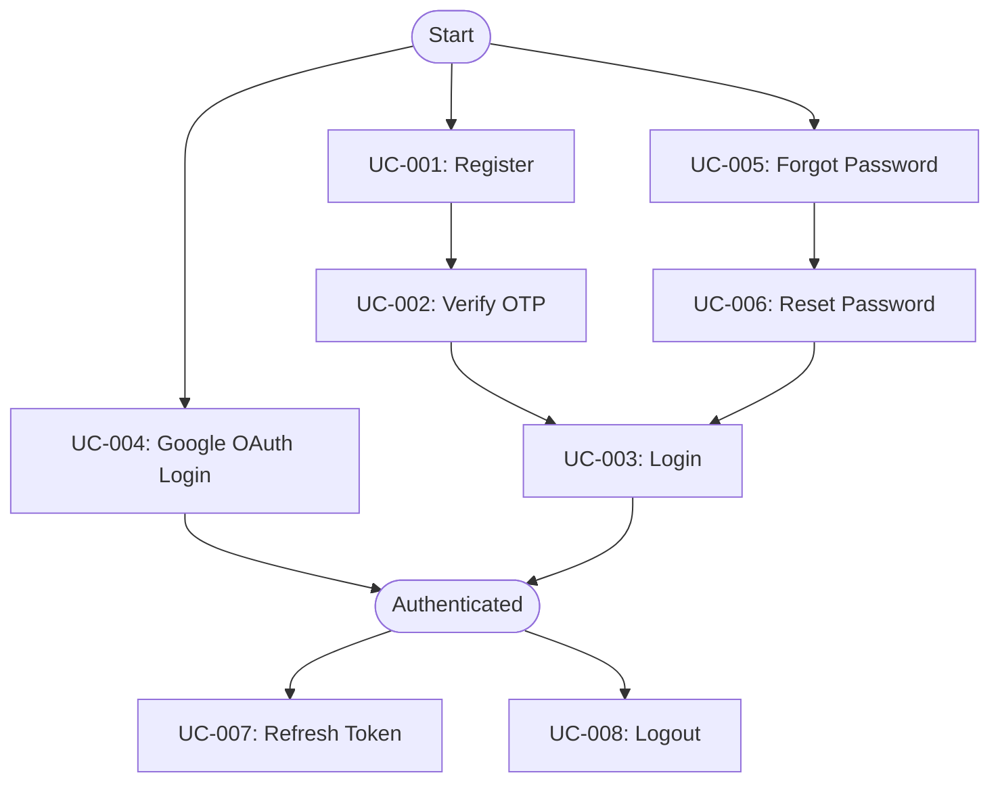

### 3.2 User Profile Module

| Use Case ID | Use Case Name | Actor(s) | Description |
|-------------|--------------|----------|-------------|
| UC-009 | View Own Profile | Learner, Mentor | See profile information, bio, skills, avatar |
| UC-010 | Edit Own Profile | Learner, Mentor | Update bio, phone, skills, username |
| UC-011 | View Any User Profile | All (Auth) | Browse another user's public profile |
| UC-012 | Block User | Admin | Restrict a user from accessing the platform |
| UC-013 | Unblock User | Admin | Restore access for a previously blocked user |

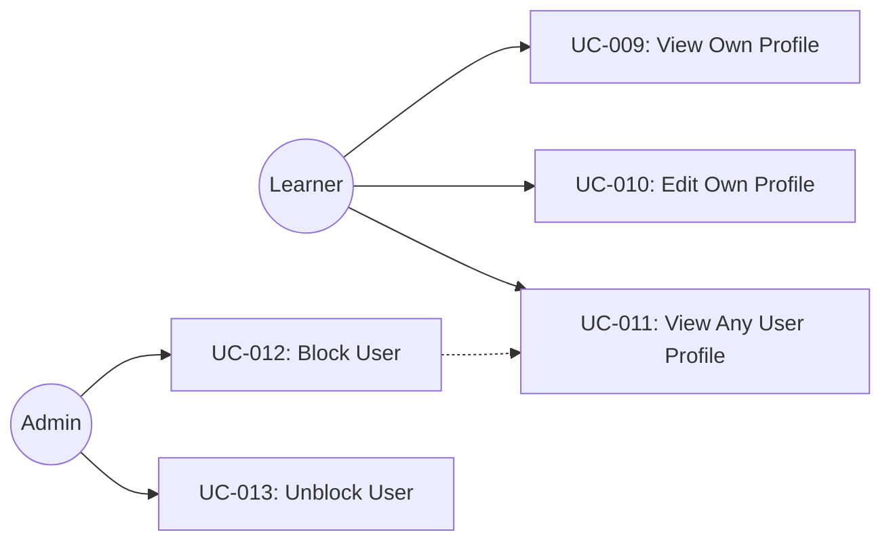

### 3.3 Mentor Module

| Use Case ID | Use Case Name | Actor(s) | Description |
|-------------|--------------|----------|-------------|
| UC-014 | Apply as Mentor | Learner | Submit mentor application with specialization, experience, rate |
| UC-015 | Browse Approved Mentors | Learner | Paginated list of all approved mentors |
| UC-016 | Search Mentors with Filters | Learner | Filter by skill, experience, rate, rating |
| UC-017 | View Mentor Profile | Learner | Detailed view of a mentor's profile |
| UC-018 | Update Availability | Mentor | Set availability status (AVAILABLE / UNAVAILABLE) |
| UC-019 | Approve Mentor Application | Admin | Approve a pending mentor application |
| UC-020 | Reject Mentor Application | Admin | Reject a pending mentor application |
| UC-021 | Suspend Mentor | Admin | Suspend an active mentor |
| UC-022 | View Pending Applications | Admin | Paginated list of all pending mentor applications |

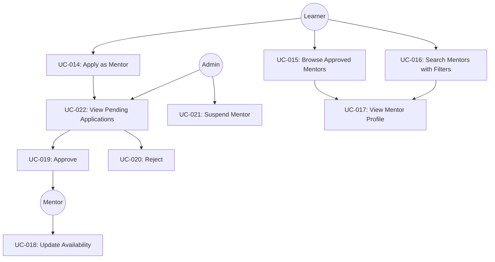

### 3.4 Session Module

| Use Case ID | Use Case Name | Actor(s) | Description |
|-------------|--------------|----------|-------------|
| UC-023 | Book a Session | Learner | Request a 1:1 session with a mentor at a specific time |
| UC-024 | Accept Session Request | Mentor | Confirm an incoming session request |
| UC-025 | Reject Session Request | Mentor | Decline with optional rejection reason |
| UC-026 | Cancel Session | Learner, Mentor | Cancel an accepted/requested session |
| UC-027 | View My Sessions | Learner, Mentor | Paginated session history with status filters |
| UC-028 | View Session Detail | Learner, Mentor | Full session details including participant info |

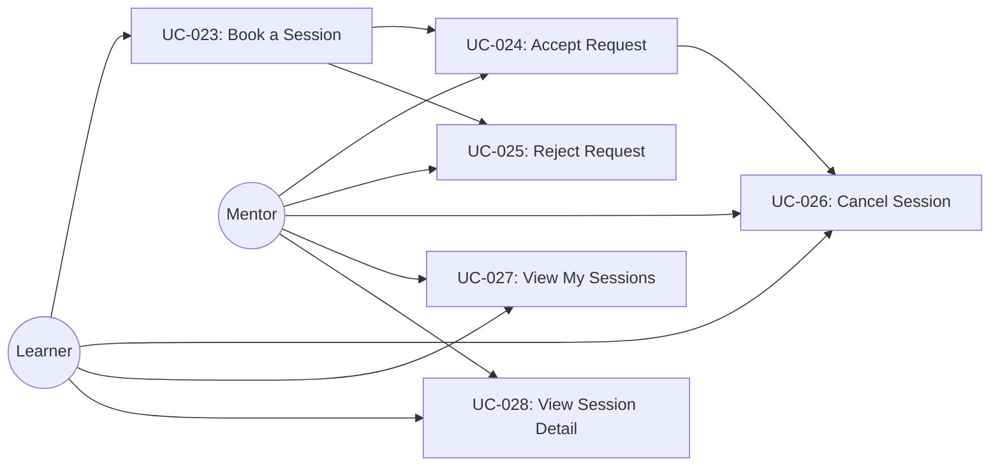

### 3.5 Group Module

| Use Case ID | Use Case Name | Actor(s) | Description |
|-------------|--------------|----------|-------------|
| UC-029 | Create Study Group | Learner, Mentor | Create a learning group tied to a skill |
| UC-030 | Browse Groups | Learner, Mentor | View all available study groups |
| UC-031 | Join Group | Learner | Join a public study group |
| UC-032 | Leave Group | Learner, Mentor | Leave a group you are a member of |
| UC-033 | View Group Details | All (Auth) | See group info, members, creator |

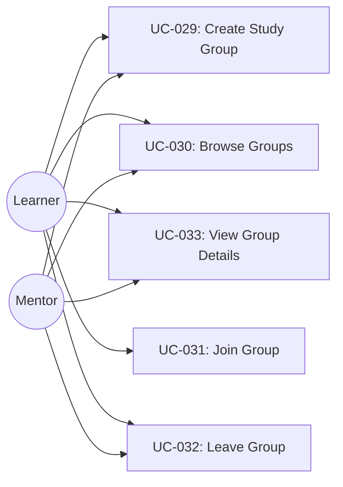

### 3.6 Review Module

| Use Case ID | Use Case Name | Actor(s) | Description |
|-------------|--------------|----------|-------------|
| UC-034 | Submit Review | Learner | Rate a mentor (1-5 stars) after a completed session |
| UC-035 | View Mentor Reviews | Learner | Browse all reviews for a specific mentor |
| UC-036 | Submit Anonymous Review | Learner | Submit review without disclosing identity |

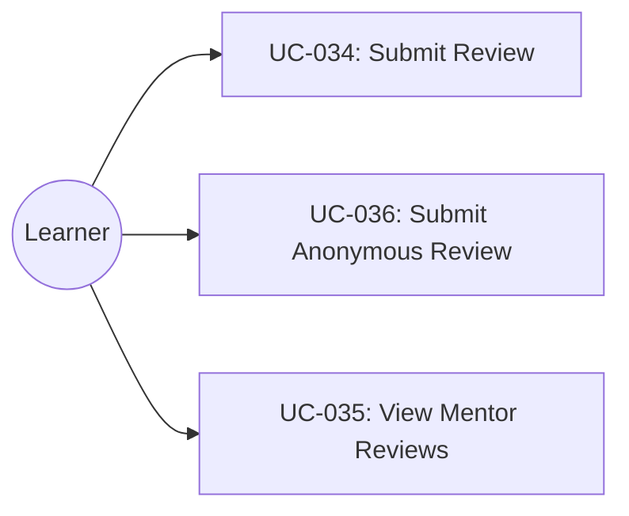

### 3.7 Payment Module

| Use Case ID | Use Case Name | Actor(s) | Description |
|-------------|--------------|----------|-------------|
| UC-037 | Initiate Payment | Learner | Create a Razorpay order for a session |
| UC-038 | Verify Payment | Learner, Razorpay | Verify payment signature after completion |
| UC-039 | View Payment History | Learner | List of all past payments |
| UC-040 | Receive Webhook | Razorpay | Receive and verify Razorpay server-side webhook events |

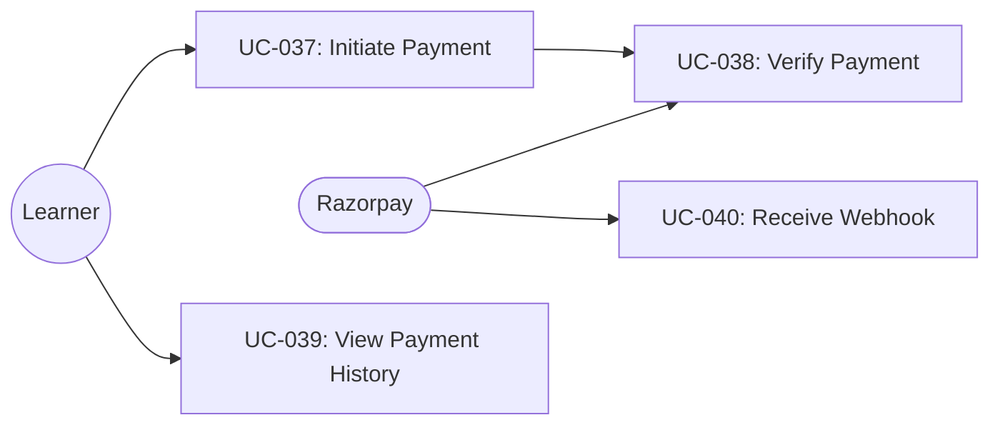

### 3.8 Notification Module

| Use Case ID | Use Case Name | Actor(s) | Description |
|-------------|--------------|----------|-------------|
| UC-041 | Receive Booking Notification | Mentor | Email alert when a learner books a session |
| UC-042 | Receive Session Status Notification | Learner | Email when session is accepted/rejected |
| UC-043 | Receive Review Notification | Mentor | Email when a learner submits a review |
| UC-044 | View Notification History | Learner, Mentor | In-app notification list |

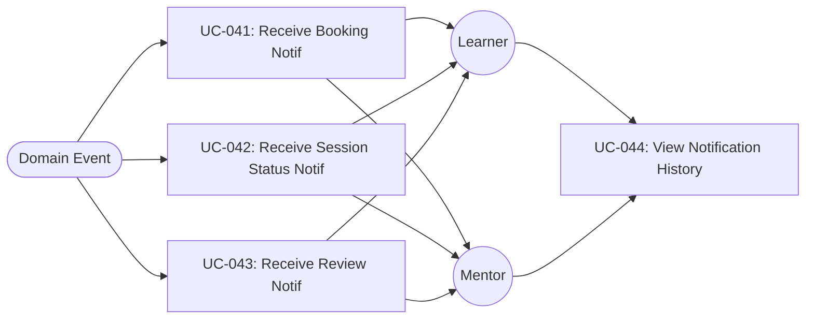

### 3.9 Admin Module

| Use Case ID | Use Case Name | Actor(s) | Description |
|-------------|--------------|----------|-------------|
| UC-045 | View All Users | Admin | Paginated user list with search |
| UC-046 | View User Detail | Admin | Full user profile + status info |
| UC-047 | View System Metrics | Admin | Access Prometheus/Grafana dashboards |

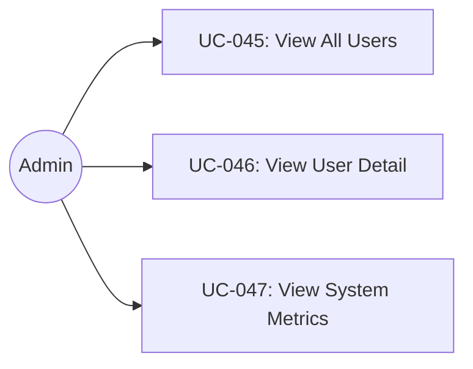

---

## 4. Use Case Diagrams (UML — Mermaid)

### 4.1 System Overview (High-Level)
This diagram illustrates the high-level interaction between actors and the primary functional modules of the SkillSync system.

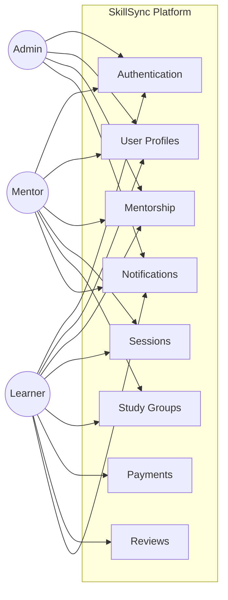

### 4.2 Identity & Access Management
Focuses on user lifecycle, authentication flows, and administrative user control.

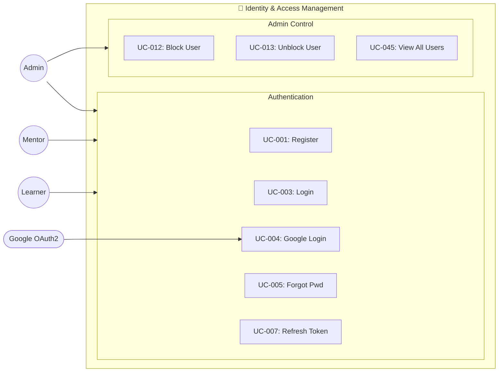

### 4.3 Mentorship & Session Lifecycle
Covers the core business logic of applying as a mentor, searching for experts, and booking/managing sessions.

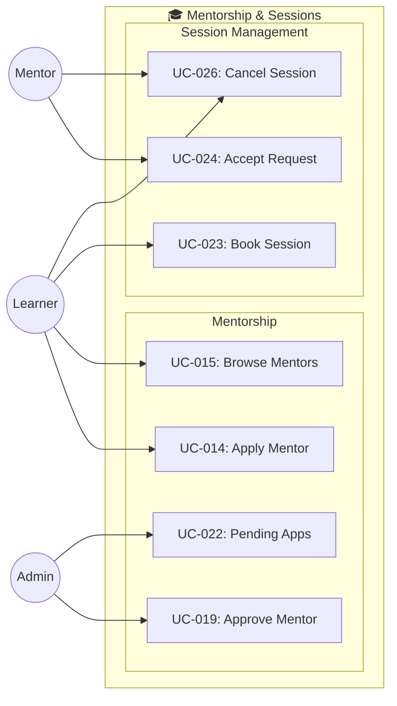

### 4.4 Engagement, Payments & Operations
Covers study groups, reviews, payment processing, and notification distribution.

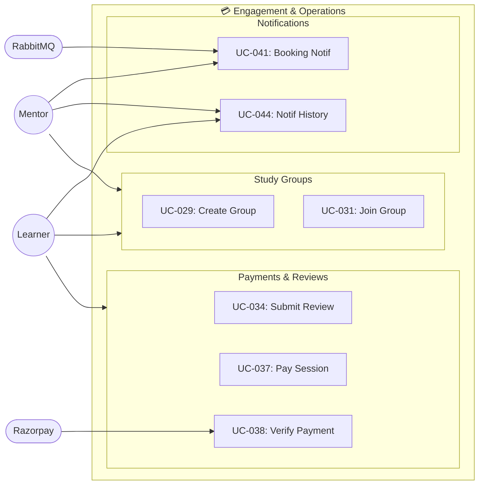

---

## 5. Major Use Case Descriptions

### UC-023: Book a Session
- **Actor:** Learner
- **Precondition:** Learner is authenticated; mentor is approved and available
- **Main Flow:**
  1. Learner selects a mentor and desired time slot
  2. System queries for conflicting sessions in the requested time range (application-level check)
  3. If no conflict, system creates Session with status `REQUESTED`; MySQL UNIQUE constraint on `(mentor_id, scheduled_at)` acts as a safety net
  4. Session Service publishes `SessionRequestedEvent` to RabbitMQ
  5. Notification Service sends email to Mentor
- **Alternate Flow:** Conflicting session found → return `409 Conflict` (double-booking prevented)
- **Postcondition:** Session record created in `skill_session`; mentor receives email notification

### UC-019: Approve Mentor Application
- **Actor:** Admin
- **Precondition:** Admin is authenticated; mentor application has status `PENDING`
- **Main Flow:**
  1. Admin views pending applications (`GET /mentor/pending`)
  2. Admin selects application and clicks Approve
  3. System validates `ROLE_ADMIN` from `roles` header
  4. Mentor profile status updated to `APPROVED`, `isApproved = true`, `approvedBy = adminId`
  5. JWT Auth service adds `ROLE_MENTOR` to the user's roles
- **Postcondition:** Mentor can now manage availability and accept sessions

### UC-034: Submit Review
- **Actor:** Learner
- **Precondition:** Session with this mentor is in `COMPLETED` status
- **Main Flow:**
  1. Learner navigates to session and clicks "Submit Review"
  2. Learner selects star rating (1–5), writes optional comment, chooses anonymity
  3. System creates Review record in `skill_review`
  4. Review Service publishes `ReviewSubmittedEvent` to RabbitMQ
  5. Mentor Service consumes event → updates mentor's average rating
  6. Notification Service sends email to Mentor
- **Postcondition:** Review saved; mentor rating updated

### UC-037: Initiate Payment
- **Actor:** Learner
- **Precondition:** Learner authenticated; session selected
- **Main Flow:**
  1. Learner clicks "Pay" on checkout page
  2. Payment Service creates a `PaymentSaga` record (idempotency key: `sessionId`)
  3. Razorpay order created via API; `correlationId` (UUID) assigned
  4. Razorpay Checkout SDK renders in browser
  5. On payment success, learner triggers `/api/payments/verify`
  6. System verifies HMAC-SHA256 signature; saga status updated to `COMPLETED`
- **Postcondition:** Payment record stored in `skill_payment`; session can proceed

---

## 6. Actor-to-Functionality Matrix

| Functionality | Learner | Mentor | Admin |
|--------------|:-------:|:------:|:-----:|
| Register / Login / OTP | ✅ | ✅ | ✅ |
| Google OAuth Login | ✅ | ✅ | — |
| Manage Own Profile | ✅ | ✅ | — |
| Browse & Search Mentors | ✅ | — | — |
| Apply as Mentor | ✅ | — | — |
| Manage Mentor Profile/Availability | — | ✅ | — |
| Book Session | ✅ | — | — |
| Accept/Reject Session | — | ✅ | — |
| Cancel Session | ✅ | ✅ | — |
| Create/Join Study Group | ✅ | ✅ | — |
| Submit Review | ✅ | — | — |
| View Reviews | ✅ | ✅ | — |
| Initiate Payment | ✅ | — | — |
| Approve/Reject Mentor | — | — | ✅ |
| Block/Unblock User | — | — | ✅ |
| Suspend Mentor | — | — | ✅ |
| View All Users | — | — | ✅ |
| View Notifications | ✅ | ✅ | — |
