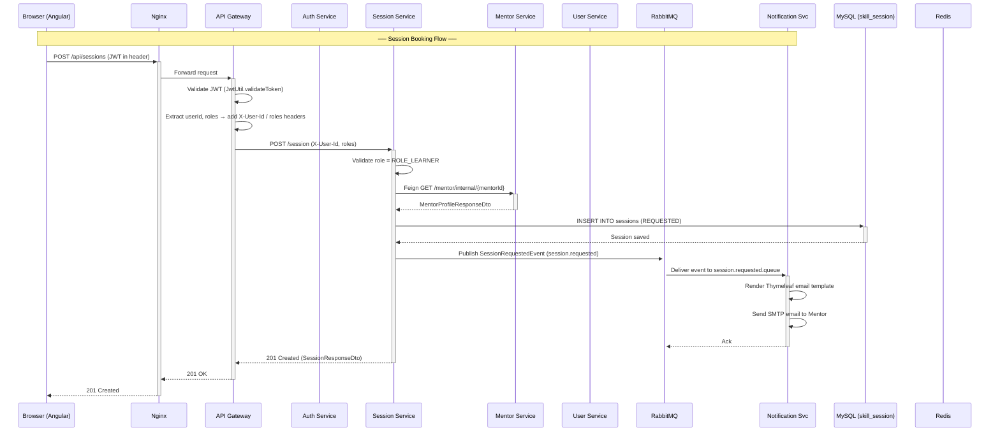
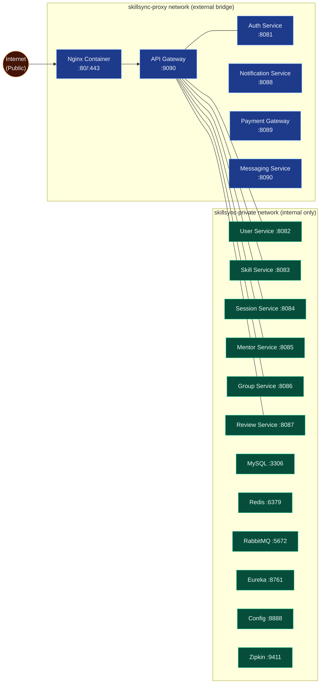
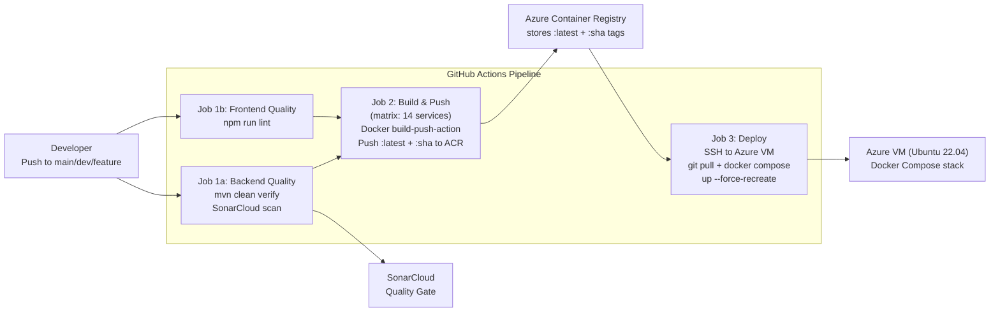

# SkillSync — Architecture Diagram

> **Version:** 1.0 | **Date:** May 2026

---

## 1. Full System Architecture

```mermaid
graph TD
    classDef client fill:#1e293b,stroke:#475569,stroke-width:2px,color:#f8fafc
    classDef edge fill:#0f172a,stroke:#3b82f6,stroke-width:2px,color:#eff6ff
    classDef gateway fill:#581c87,stroke:#a855f7,stroke-width:2px,color:#faf5ff
    classDef platform fill:#1c1917,stroke:#78716c,stroke-width:2px,color:#f5f5f4
    classDef service fill:#1e3a8a,stroke:#60a5fa,stroke-width:2px,color:#eff6ff
    classDef eventbus fill:#7c2d12,stroke:#f97316,stroke-width:2px,color:#fff7ed
    classDef db fill:#064e3b,stroke:#34d399,stroke-width:2px,color:#ecfdf5
    classDef cache fill:#1e1b4b,stroke:#818cf8,stroke-width:2px,color:#eef2ff
    classDef monitor fill:#27272a,stroke:#d4d4d8,stroke-width:2px,color:#fafafa
    classDef external fill:#431407,stroke:#fb923c,stroke-width:2px,color:#fff7ed
    classDef cicd fill:#14532d,stroke:#4ade80,stroke-width:2px,color:#f0fdf4

    %% ── Client Layer ──────────────────────────────────────────────────
    CLIENT["🖥️ Angular 18 SPA\nNgRx Signal Store | Tailwind CSS\nKarma/Jasmine Tests"]:::client

    %% ── Edge Layer ────────────────────────────────────────────────────
    NGINX["🌐 Nginx Reverse Proxy\nSSL Termination (Let's Encrypt)\nWebSocket Upgrade Headers\nPort 80/443"]:::edge

    %% ── API Gateway ───────────────────────────────────────────────────
    GATEWAY["🚪 API Gateway\nSpring Cloud Gateway\nJwtAuthenticationFilter\n→ X-User-Id + roles injection\nPort 9090"]:::gateway

    %% ── Platform Services ─────────────────────────────────────────────
    CONFIG["⚙️ Config Server\nSpring Cloud Config\nGit-backed Properties\nPort 8888"]:::platform
    EUREKA["🔍 Eureka Server\nService Registry & Discovery\nLoad Balancing\nPort 8761"]:::platform

    %% ── Microservices Layer ───────────────────────────────────────────
    subgraph MICROSERVICES["Microservices Layer (skillsync-private network)"]
        AUTH["🔐 Auth Service :8081\nJWT generation (HS256)\nGoogle OAuth2 Validation\nOTP via SMTP\nBCrypt Password Hashing\nRefresh Token (Redis)"]:::service
        USER["👤 User Service :8082\nProfile CRUD\nAdmin Block/Unblock\nRedis Cache (10min TTL)\nRabbitMQ Consumer"]:::service
        SKILL["🛠️ Skill Service :8083\nSkill Catalog\nCategory Management\nSearch & Filter"]:::service
        SESSION["📅 Session Service :8084\nCQRS Pattern\nDouble-booking Prevention\nEvent Publisher"]:::service
        MENTOR["🎓 Mentor Service :8085\nProfile Management\nApproval Workflow\nAvailability Control\nFeign → User Service"]:::service
        GROUP["👥 Group Service :8086\nStudy Group CRUD\nMembership Management"]:::service
        REVIEW["⭐ Review Service :8087\nStar Ratings (1-5)\nAnonymous Reviews\nEvent Publisher"]:::service
        NOTIF["✉️ Notification Service :8088\nRabbitMQ Consumer\nSMTP Email Dispatch\nThymeleaf Templates\nNotification History"]:::service
        PAYMENT["💳 Payment Gateway :8089\nRazorpay Integration\nPayment Saga Pattern\nWebhook Verification\nHMAC-SHA256"]:::service
        MSG["💬 Messaging Service :8090\nWebSocket / STOMP\n⏳ Under Development"]:::service
    end

    %% ── Event Bus ─────────────────────────────────────────────────────
    RABBIT["🐇 RabbitMQ\nTOPIC Exchange\nskillsync.auth.exchange\nskillsync.session.exchange\nskillsync.review.exchange\nPort 5672 / 15672"]:::eventbus

    %% ── Data Layer ────────────────────────────────────────────────────
    subgraph DATA["Data Layer"]
        DB_AUTH[("skill_auth\nMySQL")]:::db
        DB_USER[("skill_user\nMySQL")]:::db
        DB_SESS[("skill_session\nMySQL")]:::db
        DB_MENTOR[("skill_mentor\nMySQL")]:::db
        DB_SKILL[("skill_skill\nMySQL")]:::db
        DB_REVIEW[("skill_review\nMySQL")]:::db
        DB_GROUP[("skill_group\nMySQL")]:::db
        DB_NOTIF[("skill_notification\nMySQL")]:::db
        DB_PAY[("skill_payment\nMySQL")]:::db
        REDIS[("Redis 7\nCache\nRefresh Tokens\nPort 6379")]:::cache
    end

    %% ── Observability Layer ───────────────────────────────────────────
    subgraph OBSERVE["Observability Layer"]
        PROM["📊 Prometheus\nMetrics Scraping\n/actuator/prometheus"]:::monitor
        GRAFANA["📈 Grafana\nDashboards\nJVM / HTTP / Business\nPort 3000"]:::monitor
        ZIPKIN["🔍 Zipkin\nDistributed Tracing\nTrace/Span propagation\nPort 9411"]:::monitor
        LOKI["📝 Loki\nLog Storage\nPort 3100"]:::monitor
        PROMTAIL["🚚 Promtail\nLog Shipping\nDocker → Loki"]:::monitor
    end

    %% ── External Systems ──────────────────────────────────────────────
    GOOGLE["🌐 Google OAuth2\nID Token Verification"]:::external
    RAZORPAY["💰 Razorpay\nPayment Orders\nWebhook Events"]:::external
    SMTP["📬 SMTP Server\nEmail Delivery\n(Gmail / Custom)"]:::external
    ACR["🏗️ Azure Container Registry\nDocker Image Storage"]:::cicd
    GH_ACTIONS["⚡ GitHub Actions\nCI/CD Pipeline\nBuild → Push → Deploy"]:::cicd

    %% ── Flow Connections ──────────────────────────────────────────────
    CLIENT -->|HTTPS| NGINX
    NGINX -->|Proxy Pass| GATEWAY
    
    GATEWAY -->|JWT Validate + Route| AUTH
    GATEWAY -->|Route| USER
    GATEWAY -->|Route| SKILL
    GATEWAY -->|Route| SESSION
    GATEWAY -->|Route| MENTOR
    GATEWAY -->|Route| GROUP
    GATEWAY -->|Route| REVIEW
    GATEWAY -->|Route| PAYMENT
    GATEWAY -->|Route| MSG
    
    GATEWAY --> EUREKA
    GATEWAY --> CONFIG
    AUTH --> CONFIG
    USER --> CONFIG
    SESSION --> CONFIG
    MENTOR --> CONFIG

    %% Feign Client Calls (synchronous)
    SESSION -. "Feign: participant details" .-> USER
    SESSION -. "Feign: validate mentor" .-> MENTOR
    MENTOR -. "Feign: user profile" .-> USER

    %% DB Connections
    AUTH --> DB_AUTH
    USER --> DB_USER
    SESSION --> DB_SESS
    MENTOR --> DB_MENTOR
    SKILL --> DB_SKILL
    REVIEW --> DB_REVIEW
    GROUP --> DB_GROUP
    NOTIF --> DB_NOTIF
    PAYMENT --> DB_PAY

    %% Redis
    AUTH --> REDIS
    USER --> REDIS
    SESSION --> REDIS
    MENTOR --> REDIS

    %% RabbitMQ publish
    AUTH -->|"UserCreated / UserUpdated"| RABBIT
    SESSION -->|"Session Events"| RABBIT
    REVIEW -->|"ReviewSubmitted"| RABBIT
    PAYMENT -->|"PaymentCompleted"| RABBIT

    %% RabbitMQ consume
    RABBIT -->|"Consume"| USER
    RABBIT -->|"Consume all events"| NOTIF
    RABBIT -->|"ReviewSubmitted"| MENTOR

    %% External
    AUTH <-->|Google Token| GOOGLE
    PAYMENT <-->|Order / Verify| RAZORPAY
    NOTIF -->|SMTP| SMTP

    %% Observability
    AUTH --> ZIPKIN
    SESSION --> ZIPKIN
    PAYMENT --> ZIPKIN
    PROM -.->|Scrape| AUTH
    PROM -.->|Scrape| SESSION
    PROM -.->|Scrape| PAYMENT
    PROM --> GRAFANA
    PROMTAIL -->|Ship Logs| LOKI
    LOKI --> GRAFANA

    %% CI/CD
    GH_ACTIONS -->|Push Image| ACR
    ACR -->|Pull Image| GATEWAY
```

---

## 2. Service Interaction Diagram (Request / Response Flow)

---

## 3. Docker Network Topology

---

## 4. CI/CD Pipeline Architecture

---

## 5. Component Dependency Map

```mermaid
graph TB
    subgraph FOUNDATION["Foundation Layer (must start first)"]
        CONFIG_S["Config Server\n(Git-backed properties)"]
        EUREKA_S["Eureka Server\n(Service discovery)"]
        MYSQL_S["MySQL\n(10 databases)"]
        REDIS_S["Redis\n(Cache)"]
        RABBIT_S["RabbitMQ\n(Event bus)"]
        ZIPKIN_S["Zipkin\n(Distributed tracing)"]
    end

    subgraph SERVICES["Services Layer (start after Foundation)"]
        AUTH_S["Auth Service\nNeeds: Config, Eureka, MySQL, Redis, RabbitMQ"]
        USER_S["User Service\nNeeds: Config, Eureka, MySQL, Redis, RabbitMQ"]
        SKILL_S["Skill Service\nNeeds: Config, Eureka, MySQL, Redis"]
        SESS_S["Session Service\nNeeds: Config, Eureka, MySQL, Redis, RabbitMQ"]
        MENTOR_S["Mentor Service\nNeeds: Config, Eureka, MySQL, Redis, RabbitMQ"]
        GROUP_S["Group Service\nNeeds: Config, Eureka, MySQL, Redis"]
        REVIEW_S["Review Service\nNeeds: Config, Eureka, MySQL, Redis, RabbitMQ"]
        NOTIF_S["Notification Service\nNeeds: Config, Eureka, MySQL, RabbitMQ"]
        PAY_S["Payment Service\nNeeds: Config, Eureka, MySQL, RabbitMQ"]
    end

    subgraph GATEWAY_L["Gateway Layer (start last)"]
        GW_S["API Gateway\nNeeds: Config, Eureka, Zipkin"]
    end

    CONFIG_S --> AUTH_S
    CONFIG_S --> USER_S
    CONFIG_S --> SKILL_S
    CONFIG_S --> SESS_S
    CONFIG_S --> MENTOR_S
    CONFIG_S --> GW_S
    EUREKA_S --> AUTH_S
    EUREKA_S --> GW_S
    MYSQL_S --> AUTH_S
    MYSQL_S --> USER_S
    MYSQL_S --> SESS_S
    REDIS_S --> AUTH_S
    REDIS_S --> USER_S
    REDIS_S --> SESS_S
    RABBIT_S --> AUTH_S
    RABBIT_S --> SESS_S
    RABBIT_S --> REVIEW_S
    RABBIT_S --> NOTIF_S
```

