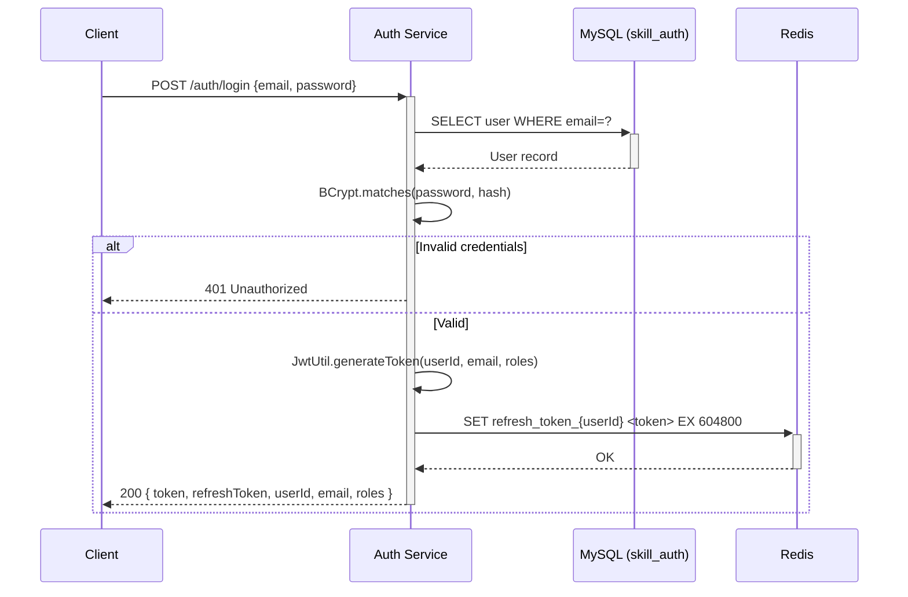
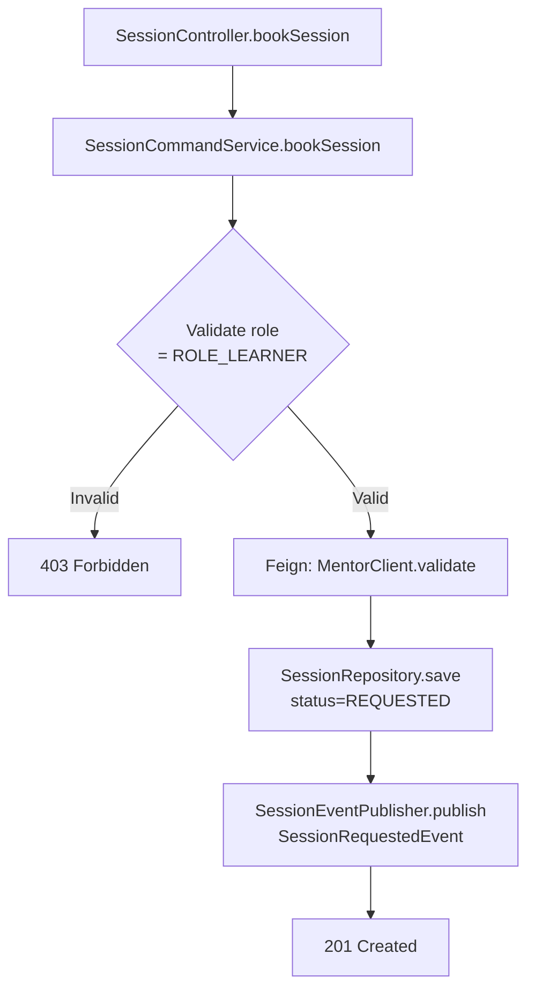
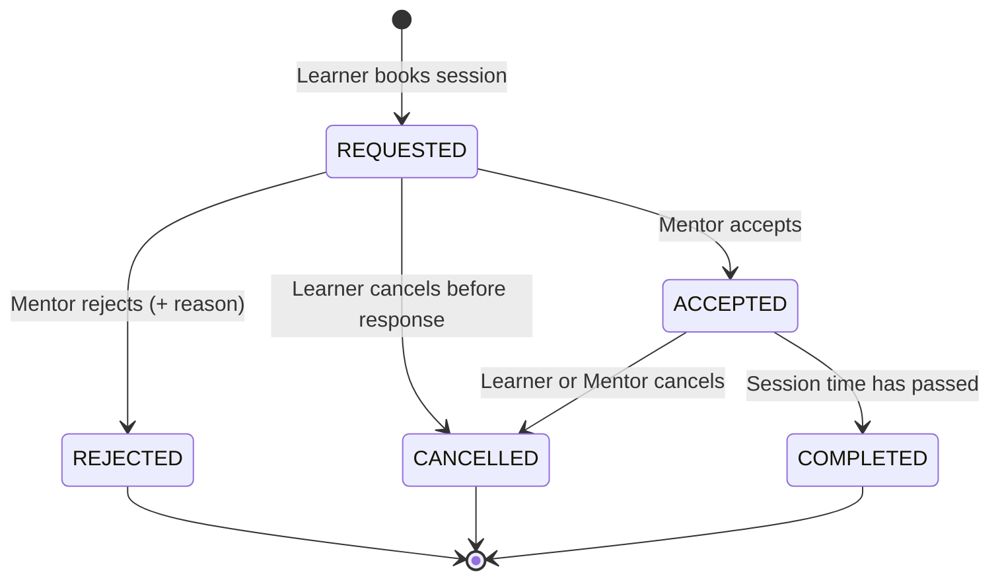
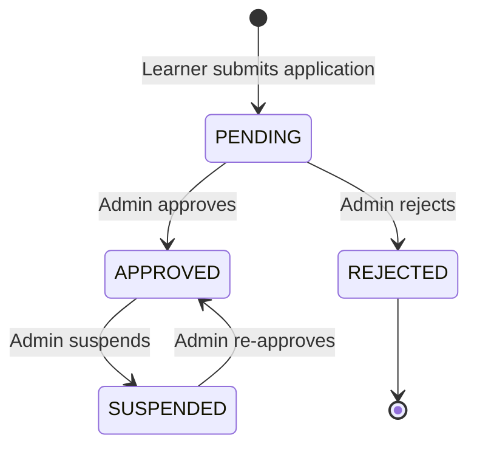
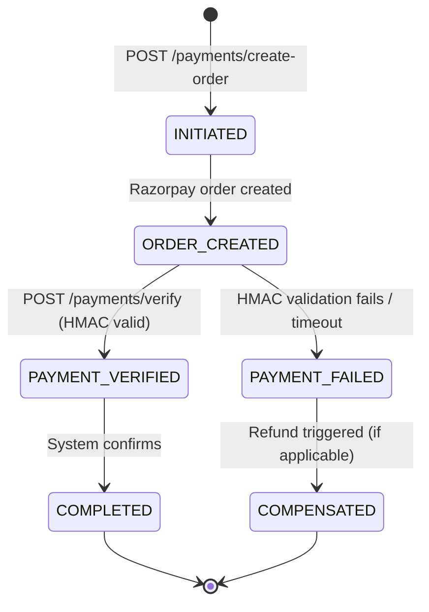
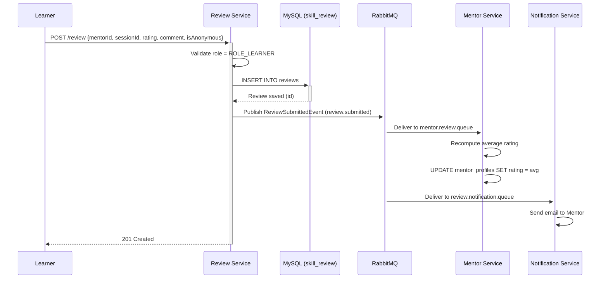
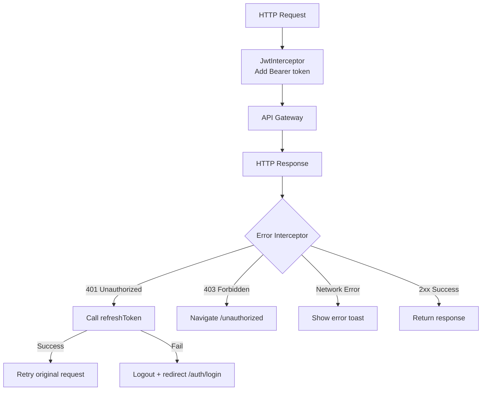

# SkillSync — Low Level Design (LLD)

> **Version:** 1.0 | **Date:** May 2026

---

## 1. Overview

This document provides the detailed, implementation-level design of each microservice and the frontend architecture in SkillSync. It covers internal package structures, class responsibilities, API contracts inferred from source code, CQRS patterns, sequence flows, error handling, and state transitions.

---

## 2. Cross-Cutting Concerns (Applied to ALL Services)

### 2.1 API Response Standard

Every REST endpoint returns one of three shapes:

```json
// Success (single resource)
{ "success": true, "data": { ... }, "message": "Operation successful", "statusCode": 200 }

// Error
{ "success": false, "error": "...", "message": "User-friendly message", "statusCode": 400 }

// Paginated
{ "content": [...], "page": 0, "size": 12, "totalElements": 100, "totalPages": 9 }
```

### 2.2 GatewayRequestFilter (All Downstream Services)

```java
// OncePerRequestFilter in each service (not Auth)
// Validates that the request passed through the API Gateway
if (!hasGatewayHeader && !hasValidAuth) {
    response.setStatus(403);  // Forbidden
}
// Internal paths (/internal/**) are whitelisted
// Swagger/Actuator paths are whitelisted
```

### 2.3 Auditable Base Class

All entities extend `Auditable`:
```java
@MappedSuperclass
public abstract class Auditable {
    @CreatedDate / @LastModifiedDate
    private LocalDateTime createdAt, updatedAt;
}
```

### 2.4 Distributed Tracing

- All services use `micrometer-tracing-bridge-brave` + `zipkin-reporter-brave`
- Every log line carries `traceId` and `spanId` via `logstash-logback-encoder`
- RabbitMQ messages propagate trace context via observation headers

### 2.5 Health & Metrics Endpoints

```
GET /actuator/health      → Used by Docker healthcheck and Eureka
GET /actuator/prometheus  → Scraped by Prometheus every 15 seconds
```

---

## 3. Auth Service (Port 8081)

### 3.1 Package Structure

```
com.skillsync.authservice
├── controller/
│   ├── AuthController              # POST /auth/*
│   └── internal/
│       └── InternalUserController  # Feign endpoint for other services
├── service/
│   ├── AuthServiceImpl             # Core login/register/OTP logic
│   ├── OAuthService                # Google ID token verification
│   └── OtpService                  # OTP generation + Redis storage (5min TTL)
├── security/
│   ├── JwtUtil                     # JWT sign/validate/parse (HS256)
│   ├── JwtFilter                   # OncePerRequestFilter
│   ├── CustomUserDetails           # UserDetails adapter
│   ├── CustomUserDetailsService    # Loads user from DB by email
│   ├── InternalServiceFilter       # Validates X-Internal-Secret header
│   └── SecurityExceptionHandler   
├── publisher/
│   └── AuthEventPublisher          # Publishes to skillsync.auth.exchange
├── event/
│   ├── UserCreatedEvent            # {userId, email, name, role, username}
│   └── UserUpdatedEvent            # {userId, name, avatarUrl}
├── config/
│   ├── RabbitMQConfig              # Declares TOPIC exchange
│   ├── RedisConfig                 # Refresh token store
│   └── SecurityConfig             # Permits public endpoints
├── audit/
│   └── AuditService / AuditLog    # Logs all auth events
└── entity/
    └── User                        # See DB Design doc
```

### 3.2 REST API Contract

| Method | Path | Auth Required | Description |
|--------|------|:-------------:|-------------|
| `POST` | `/auth/register` | ❌ | Register; triggers OTP email |
| `POST` | `/auth/send-otp` | ❌ | Resend OTP to email |
| `POST` | `/auth/verify-otp` | ❌ | Verify OTP; activate account |
| `POST` | `/auth/login` | ❌ | Email/password → JWT |
| `POST` | `/auth/oauth/google` | ❌ | Google ID Token → JWT |
| `POST` | `/auth/refresh` | ❌ | Rotate JWT via refresh token cookie |
| `POST` | `/auth/forgot-password` | ❌ | Send password reset OTP |
| `POST` | `/auth/verify-forgot-password` | ❌ | Validate reset OTP |
| `POST` | `/auth/reset-password` | ❌ | Set new password with valid OTP |
| `GET`  | `/auth/internal/user/{userId}` | X-Internal-Secret | Internal Feign endpoint |

### 3.3 JWT Token Structure

```json
{
  "sub": "user@email.com",
  "userId": 42,
  "roles": ["ROLE_LEARNER"],
  "iat": 1746789012,
  "exp": 1746792612
}
```

### 3.4 Key Logic Flow — Login



### 3.5 RabbitMQ Events Published

| Event | Exchange | Routing Key | Payload |
|-------|----------|-------------|---------|
| `UserCreatedEvent` | `skillsync.auth.exchange` | `user.created` | `{userId, email, name, role, username}` |
| `UserUpdatedEvent` | `skillsync.auth.exchange` | `user.updated` | `{userId, name, avatarUrl}` |

---

## 4. User Service (Port 8082)

### 4.1 Package Structure

```
com.skillsync.userservice
├── controller/
│   └── UserController             # GET/PUT /users/*, admin operations
├── service/
│   └── UserServiceImpl            # Profile CRUD + Redis cache-aside
├── consumer/
│   └── AuthEventConsumer          # @RabbitListener on user.created / user.updated
├── config/
│   ├── RabbitMQConfig             # Queue: user.queue, binding: user.#
│   └── RedisConfig                # user_profile_{userId} keys
└── entity/
    └── UserProfile                # See DB Design doc
```

### 4.2 REST API Contract

| Method | Path | Auth Required | Role | Description |
|--------|------|:-------------:|------|-------------|
| `GET`  | `/users/{id}` | ✅ | Any | Get user profile by ID |
| `GET`  | `/users/me` | ✅ | Any | Get own profile |
| `PUT`  | `/users/me` | ✅ | Any | Update own profile |
| `GET`  | `/users?search=&page=&size=` | ✅ | Any | Search/list users (paginated) |
| `PUT`  | `/users/{id}/block` | ✅ | Admin | Block user with reason |
| `PUT`  | `/users/{id}/unblock` | ✅ | Admin | Unblock user |
| `GET`  | `/users/internal/{id}` | X-Gateway-Request | — | Internal Feign lookup |

### 4.3 Redis Cache Strategy

```
Key:   user_profile_{userId}
Value: Serialized UserProfile JSON
TTL:   10 minutes

Cache-Aside Pattern:
  GET → Check Redis → If miss → Query DB → Store in Redis → Return
  PUT → Update DB → Evict Redis key → Return
```

### 4.4 RabbitMQ Consumption

```java
@RabbitListener(queues = "user.queue")
public void handleUserCreated(UserCreatedEvent event) {
    // Creates UserProfile record in skill_user DB
    // Populates: userId, email, name, role, username
}

@RabbitListener(queues = "user.updated.queue")
public void handleUserUpdated(UserUpdatedEvent event) {
    // Updates name, avatarUrl in skill_user DB
    // Evicts Redis cache key
}
```

---

## 5. Session Service (Port 8084) — CQRS Pattern

### 5.1 Package Structure (CQRS)

```
com.skillsync.session
├── controller/
│   └── SessionController           # Routes to Command or Query service
├── service/
│   ├── SessionCommandService       # Writes: book, accept, reject, cancel
│   └── SessionQueryService         # Reads: history, detail, list (paginated)
├── repository/
│   └── SessionRepository           # JPA repository
├── event/
│   ├── SessionEventPublisher       # RabbitMQ publish
│   └── events/                     # SessionRequested/Accepted/Rejected/Cancelled
├── feign/
│   ├── UserClient                  # Feign → User Service
│   └── MentorClient                # Feign → Mentor Service
└── entity/
    ├── Session                     # See DB Design
    └── SessionStatus               # REQUESTED, ACCEPTED, REJECTED, CANCELLED, COMPLETED
```

### 5.2 Command Flow (Write Path)



### 5.3 Double-Booking Prevention

```java
// Layer 1: Application-level conflict check
// SessionRepository.findSessionsInTimeRange(...) returns existing slots

// Layer 2: MySQL UNIQUE constraint (Safety Net)
@UniqueConstraint(columnNames = {"mentor_id", "scheduled_at"})
// Prevents race conditions if two threads pass Layer 1 simultaneously
```

### 5.4 Session State Machine



### 5.5 REST API Contract

| Method | Path | Auth Required | Role | Description |
|--------|------|:-------------:|------|-------------|
| `POST` | `/session` | ✅ | Learner | Book a session |
| `GET`  | `/session/my` | ✅ | Any | My sessions (paginated) |
| `GET`  | `/session/{id}` | ✅ | Any | Session details |
| `PUT`  | `/session/{id}/accept` | ✅ | Mentor | Accept session |
| `PUT`  | `/session/{id}/reject` | ✅ | Mentor | Reject session |
| `PUT`  | `/session/{id}/cancel` | ✅ | Any | Cancel session |

### 5.6 Events Published

| Event | Routing Key | Trigger |
|-------|-------------|---------|
| `SessionRequestedEvent` | `session.requested` | On booking creation |
| `SessionAcceptedEvent` | `session.accepted` | On mentor accept |
| `SessionRejectedEvent` | `session.rejected` | On mentor reject |
| `SessionCancelledEvent` | `session.cancelled` | On cancellation |

---

## 6. Mentor Service (Port 8085)

### 6.1 REST API Contract (from MentorController.java)

| Method | Path | Auth Required | Role | Description |
|--------|------|:-------------:|------|-------------|
| `POST` | `/mentor/apply` | ✅ | Learner/Mentor | Submit mentor application |
| `GET`  | `/mentor/{mentorId}` | ✅ | Any | Get mentor profile |
| `GET`  | `/mentor/profile/me` | ✅ | Mentor | Own mentor profile |
| `GET`  | `/mentor/approved?page=&size=` | ✅ | Any | All approved mentors (paginated) |
| `GET`  | `/mentor/pending?page=&size=` | ✅ | Admin | Pending applications (paginated) |
| `GET`  | `/mentor/search` | ✅ | Any | Filter by skill, experience, rate, rating |
| `PUT`  | `/mentor/{id}/approve` | ✅ | Admin | Approve application |
| `PUT`  | `/mentor/{id}/reject` | ✅ | Admin | Reject application |
| `PUT`  | `/mentor/{id}/suspend` | ✅ | Admin | Suspend mentor |
| `PUT`  | `/mentor/availability` | ✅ | Mentor | Update availability status |
| `PUT`  | `/mentor/{id}/rating` | Internal | — | Update mentor rating (event-driven) |
| `GET`  | `/mentor/internal/{mentorId}` | X-Gateway-Request | — | Internal Feign endpoint |

### 6.2 Mentor Status State Machine



### 6.3 Role Authorization Pattern

```java
// From MentorController — header-based role check (no Spring Security @PreAuthorize)
@RequestHeader(value = "roles", required = false) String roles

if (roles == null || !roles.contains("ROLE_ADMIN")) {
    throw new ResponseStatusException(HttpStatus.FORBIDDEN, "Only admins can approve mentors");
}
```

---

## 7. Payment Service (Port 8089) — Saga Pattern

### 7.1 Payment Saga State Machine



### 7.2 REST API Contract

| Method | Path | Auth Required | Description |
|--------|------|:-------------:|-------------|
| `POST` | `/payment/create-order` | ✅ | Create Razorpay order; persist PaymentSaga |
| `POST` | `/payment/verify` | ✅ | Verify HMAC signature; update saga |
| `GET`  | `/payment/history` | ✅ | Paginated payment history |
| `POST` | `/payment/payments` | ❌ | Razorpay webhook receiver |

### 7.3 Idempotency Key

```java
// One PaymentSaga per session — prevents duplicate charges
@Column(name = "session_id", unique = true)
private Long sessionId;  // Idempotency key

@Column(name = "correlation_id", unique = true)
private String correlationId; // UUID for distributed tracing
```

---

## 8. Notification Service (Port 8088)

### 8.1 Event Consumption Queue Map

| Queue | Bound to | Trigger |
|-------|----------|---------|
| `session.requested.queue` | `session.requested` routing key | Learner books session |
| `session.accepted.queue` | `session.accepted` routing key | Mentor accepts |
| `session.rejected.queue` | `session.rejected` routing key | Mentor rejects |
| `review.submitted.queue` | `review.submitted` routing key | Learner reviews |

### 8.2 Email Templates (Thymeleaf)

| Template | Recipient | Trigger Event |
|----------|-----------|---------------|
| `session-requested.html` | Mentor | `SessionRequestedEvent` |
| `session-accepted.html` | Learner | `SessionAcceptedEvent` |
| `session-rejected.html` | Learner | `SessionRejectedEvent` |
| `review-submitted.html` | Mentor | `ReviewSubmittedEvent` |
| `welcome.html` | New user | `UserCreatedEvent` |

### 8.3 Processing Pipeline

```
RabbitMQ delivers event
  → @RabbitListener deserializes JSON → Event POJO
  → NotificationHandler dispatches by event type
  → EmailService renders Thymeleaf template with event data
  → JavaMailSender sends via SMTP (TLS)
  → Notification record persisted in skill_notification DB
```

---

## 9. Review Service (Port 8087)

### 9.1 REST API Contract

| Method | Path | Auth Required | Role | Description |
|--------|------|:-------------:|------|-------------|
| `POST` | `/review` | ✅ | Learner | Submit review (rating 1-5, comment, isAnonymous) |
| `GET`  | `/review/mentor/{mentorId}` | ✅ | Any | All reviews for a mentor (paginated) |
| `GET`  | `/review/my` | ✅ | Learner | My submitted reviews |

### 9.2 Review Submission Flow



---

## 10. Group Service (Port 8086)

### 10.1 REST API Contract

| Method | Path | Auth Required | Description |
|--------|------|:-------------:|-------------|
| `POST` | `/groups` | ✅ | Create study group |
| `GET`  | `/groups?page=&size=` | ✅ | Browse all groups (paginated) |
| `GET`  | `/groups/{id}` | ✅ | Group details |
| `POST` | `/groups/{id}/join` | ✅ | Join group |
| `DELETE` | `/groups/{id}/leave` | ✅ | Leave group |
| `GET`  | `/groups/{id}/members` | ✅ | Group member list |

### 10.2 Unique Membership Constraint

```java
@UniqueConstraint(columnNames = {"group_id", "user_id"}, name = "uk_group_user")
// Prevents a user from joining the same group twice
```

---

## 11. API Gateway (Port 9090)

### 11.1 Route Configuration (from Config Server)

```yaml
spring:
  cloud:
    gateway:
      routes:
        - id: auth-service
          uri: lb://auth-service          # Eureka load balanced
          predicates: [Path=/api/auth/**]
          
        - id: user-service
          uri: lb://user-service
          predicates: [Path=/api/users/**]
          
        - id: mentor-service
          uri: lb://mentor-service
          predicates: [Path=/api/mentor/**]
          
        - id: session-service
          uri: lb://session-service
          predicates: [Path=/api/session/**]
          
        - id: review-service
          uri: lb://review-service
          predicates: [Path=/api/review/**]
          
        - id: payment-service
          uri: lb://payment-gateway
          predicates: [Path=/api/payment/**]
```

### 11.2 JwtAuthenticationFilter Logic (from source)

```
1. OPTIONS requests → Skip (CORS preflight)
2. Mark request: add X-Gateway-Request: true header
3. If not a public endpoint:
   a. Check Authorization header present
   b. Validate "Bearer " prefix
   c. Call JwtUtil.validateToken(token)
   d. Extract: email (sub), userId, roles from Claims
   e. Mutate request headers:
      → X-User-Id: {userId}
      → loggedInUser: {email}
      → roles: {ROLE_LEARNER,ROLE_MENTOR,...}
4. Forward to downstream service
```

### 11.3 Public Endpoints (No JWT Required)

```java
List<String> PUBLIC_ENDPOINTS = List.of(
    "/api/auth/login", "/api/auth/register", "/api/auth/refresh",
    "/api/auth/send-otp", "/api/auth/verify-otp",
    "/api/auth/forgot-password", "/api/auth/verify-forgot-password",
    "/api/auth/reset-password", "/api/auth/oauth/google",
    "/api/payment/payments",  // Razorpay webhook
    "/eureka", "/swagger-ui", "/v3/api-docs", "/webjars/"
);
```

---

## 12. Frontend Angular 18 Architecture

### 12.1 Module Structure

```
src/app/
├── core/
│   ├── store/
│   │   └── auth.store.ts           # NgRx Signal Store (AuthStore)
│   ├── services/
│   │   ├── auth.service.ts         # HTTP calls to /api/auth
│   │   ├── user.service.ts         # HTTP calls to /api/users
│   │   ├── mentor.service.ts       # HTTP calls to /api/mentor
│   │   ├── session.service.ts      # HTTP calls to /api/session
│   │   ├── review.service.ts       # HTTP calls to /api/review
│   │   ├── skill.service.ts        # HTTP calls to /api/skills
│   │   ├── group.service.ts        # HTTP calls to /api/groups
│   │   └── payment.service.ts      # HTTP calls to /api/payment
│   ├── interceptors/
│   │   ├── jwt.interceptor.ts      # Injects Bearer token on every request
│   │   └── error.interceptor.ts    # Handles 401 (refresh) / 403 (redirect)
│   └── guards/
│       ├── auth.guard.ts           # Redirects unauthenticated users
│       └── role.guard.ts           # Redirects unauthorized roles
│
├── features/
│   ├── auth/          # Login, Register, VerifyOtp, ForgotPassword, ResetPassword
│   ├── mentors/       # MentorList, MentorDetail, ApplyMentor pages
│   ├── sessions/      # MySessions, MentorSessions, RequestSession, SessionDetail
│   ├── groups/        # GroupList, GroupDetail
│   ├── messaging/     # ChatPage (⏳ WebSocket integration pending)
│   ├── reviews/       # MentorReviews
│   ├── payment/       # Checkout (Razorpay SDK integration)
│   ├── notifications/ # NotificationList
│   ├── profile/       # ViewProfile, EditProfile
│   ├── skills/        # SkillList
│   ├── admin/         # AdminUsers, PendingMentors, UserDetail
│   └── public/        # Home (landing page)
│
├── layout/
│   ├── navbar/        # NavbarComponent (role-aware navigation)
│   ├── sidebar/       # SidebarComponent
│   ├── shell/         # ShellComponent (authenticated layout wrapper)
│   └── theme-toggle/  # Dark/Light mode
│
└── shared/
    ├── components/    # PaginationComponent, ToastComponent, Unauthorized
    ├── models/        # TypeScript interfaces (DTO shapes)
    └── services/      # ToastService
```

### 12.2 AuthStore (NgRx Signals) — State Management

```typescript
interface AuthState {
  token: string | null;
  userId: number | null;
  email: string | null;
  username: string | null;
  roles: string[];
  loading: boolean;
  error: string | null;
  otpSent: boolean;
  otpVerified: boolean;
}

// Computed signals (derived state)
isAuthenticated: computed(() => !!store.token())
isAdmin:         computed(() => store.roles().includes('ROLE_ADMIN'))
isMentor:        computed(() => store.roles().includes('ROLE_MENTOR'))
isLearner:       computed(() => store.roles().includes('ROLE_LEARNER'))

// Methods (rxMethod for async; patchState for sync)
login(), register(), logout(), sendOtp(), verifyOtp(),
googleLogin(), refreshToken(), addRole(), updateUser()
```

### 12.3 HTTP Interceptor Chain

```
Outgoing Request
  → JwtInterceptor: adds "Authorization: Bearer <token>" header
  → HTTP call to API Gateway

Incoming Response
  → ErrorInterceptor:
      401 → calls authStore.refreshToken() → retry once
      403 → navigate to /unauthorized
      Network error → show toast notification
```

### 12.4 Route Guards

```typescript
// auth.guard.ts — blocks unauthenticated access
export const authGuard: CanActivateFn = () => {
    const store = inject(AuthStore);
    return store.isAuthenticated() ? true : router.navigate(['/auth/login']);
};

// role.guard.ts — blocks unauthorized roles
export const roleGuard: CanActivateFn = (route) => {
    const requiredRole = route.data['role'];  // e.g., 'ROLE_ADMIN'
    const store = inject(AuthStore);
    return store.roles().includes(requiredRole) ? true : router.navigate(['/unauthorized']);
};
```

### 12.5 Login Flow — Post-Authentication Routing

```typescript
// After successful login, role-based redirect:
if (roles.includes('ROLE_ADMIN'))  → navigate(['/admin/users'])
if (roles.includes('ROLE_MENTOR')) → navigate(['/mentor-dashboard'])
else                               → navigate(['/mentors'])
```

### 12.6 Error Handling Flow



---

## 13. Internal Dependency Map

```
Config Server → All Services (bootstrap configuration)
Eureka Server → All Services (service registration)
API Gateway   → All Services (routing; depends on Eureka)

Auth Service
  → Publishes: user.created, user.updated → RabbitMQ
  → Consumes: nothing

User Service
  → Consumes: user.created, user.updated ← RabbitMQ
  → Cache: Redis (user_profile_{userId})

Session Service
  → Feign→ User Service (participant details)
  → Feign→ Mentor Service (mentor validation)
  → Publishes: session.* events → RabbitMQ

Mentor Service
  → Feign→ User Service (profile resolution)
  → Consumes: review.submitted ← RabbitMQ (rating update)

Review Service
  → Publishes: review.submitted → RabbitMQ

Notification Service
  → Consumes: session.*, review.* ← RabbitMQ
  → SMTP: email delivery

Payment Service
  → External: Razorpay API
  → Publishes: payment.completed → RabbitMQ
```
