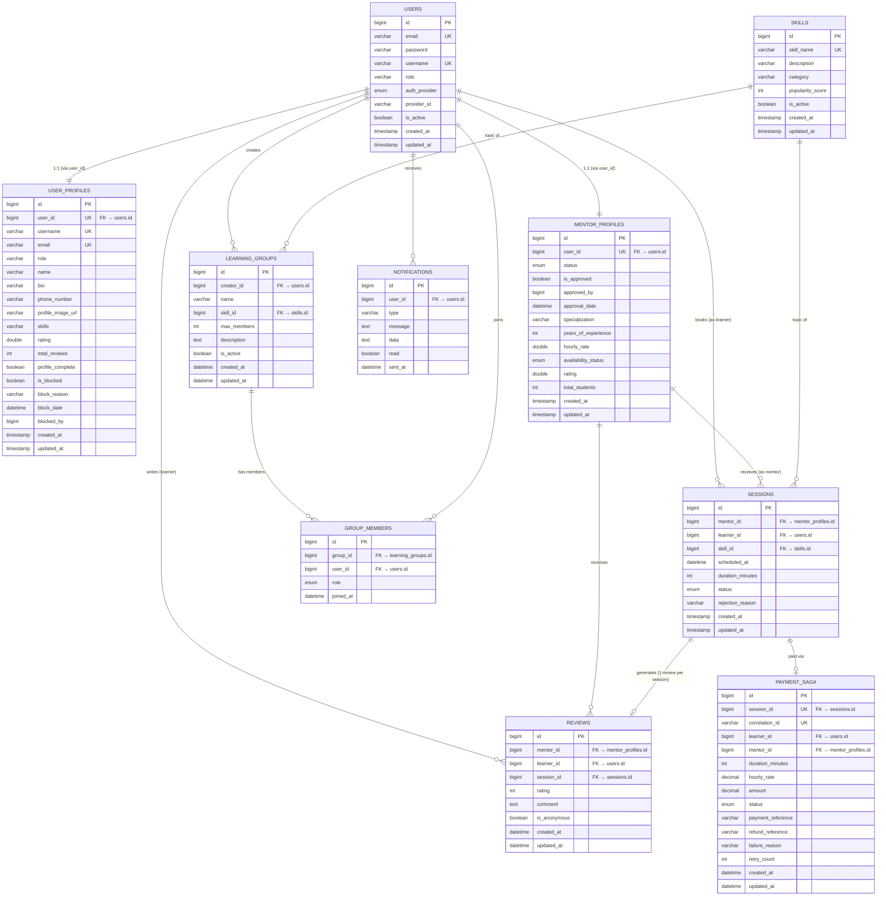

# SkillSync — Database Design / ER Diagram

> **Version:** 1.0 | **Date:** May 2026 | **Pattern:** Database-per-Service

---

## 1. Design Principles

- **Database-per-Service**: Each microservice owns its private MySQL 8.0 database; no shared schemas, no cross-DB foreign key constraints
- **Referential Integrity by Reference**: Cross-service relationships are maintained via `userId`, `mentorId`, `sessionId` columns (logical foreign keys, not enforced at DB level)
- **Audit Trail**: All service databases use an `Auditable` base class with `created_at` and `updated_at`
- **Idempotency**: Critical records (PaymentSaga, GroupMember) have unique constraints to prevent duplicates
- **Normalization**: Schemas are in 3NF; junction tables used for M:N relationships (GroupMember)

---

## 2. Database Inventory

| Database | Service | Port Served |
|----------|---------|-------------|
| `skill_auth` | Auth Service | 8081 |
| `skill_user` | User Service | 8082 |
| `skill_skill` | Skill Service | 8083 |
| `skill_session` | Session Service | 8084 |
| `skill_mentor` | Mentor Service | 8085 |
| `skill_group` | Group Service | 8086 |
| `skill_review` | Review Service | 8087 |
| `skill_notification` | Notification Service | 8088 |
| `skill_payment` | Payment Service | 8089 |
| `zipkin` | Zipkin (tracing) | 9411 |

---

## 3. Entity Schemas

### 3.1 `skill_auth` — Auth Service

#### Table: `users`

| Column | Type | Constraints | Description |
|--------|------|-------------|-------------|
| `id` | BIGINT | PK, AUTO_INCREMENT | Internal user ID |
| `email` | VARCHAR(255) | NOT NULL, UNIQUE | Login email |
| `password` | VARCHAR(255) | NOT NULL | BCrypt hashed password (OAuth users get dummy password) |
| `username` | VARCHAR(100) | NOT NULL, UNIQUE | Display username |
| `role` | VARCHAR(50) | NOT NULL | `ROLE_LEARNER`, `ROLE_MENTOR`, `ROLE_ADMIN` |
| `auth_provider` | ENUM | NOT NULL, DEFAULT 'LOCAL' | `LOCAL`, `GOOGLE` |
| `provider_id` | VARCHAR(100) | NULL | Google/GitHub unique user ID |
| `is_active` | BOOLEAN | NOT NULL, DEFAULT TRUE | Account active flag |
| `created_at` | TIMESTAMP | NOT NULL, AUTO | Record creation timestamp |
| `updated_at` | TIMESTAMP | AUTO UPDATE | Last modification timestamp |

**Indexes:**
- `PK: id`
- `UNIQUE: email`
- `UNIQUE: username`

---

### 3.2 `skill_user` — User Service

#### Table: `user_profiles`

| Column | Type | Constraints | Description |
|--------|------|-------------|-------------|
| `id` | BIGINT | PK, AUTO_INCREMENT | Profile record ID |
| `user_id` | BIGINT | NOT NULL, UNIQUE | Logical FK → `skill_auth.users.id` |
| `username` | VARCHAR(255) | UNIQUE | Display username (synced from Auth) |
| `email` | VARCHAR(255) | NOT NULL, UNIQUE | User email (synced from Auth) |
| `role` | VARCHAR(50) | | User role string |
| `name` | VARCHAR(255) | | Full display name |
| `bio` | VARCHAR(500) | | User biography |
| `phone_number` | VARCHAR(50) | | Contact number |
| `profile_image_url` | VARCHAR(255) | | Avatar/profile photo URL |
| `skills` | VARCHAR(500) | | Comma-separated or JSON skills list |
| `rating` | DOUBLE | DEFAULT 0.0 | Aggregated rating (populated for mentors) |
| `total_reviews` | INT | DEFAULT 0 | Review count |
| `profile_complete` | BOOLEAN | NOT NULL, DEFAULT FALSE | Profile completion flag |
| `is_blocked` | BOOLEAN | NOT NULL, DEFAULT FALSE | Admin block flag |
| `block_reason` | VARCHAR(500) | | Reason for blocking |
| `block_date` | DATETIME | | When user was blocked |
| `blocked_by` | BIGINT | | Admin userId who blocked |
| `created_at` | TIMESTAMP | NOT NULL | |
| `updated_at` | TIMESTAMP | NOT NULL | |

**Indexes:**
- `PK: id`
- `UNIQUE: user_id` (one profile per auth user)
- `UNIQUE: email`
- `UNIQUE: username`

---

### 3.3 `skill_skill` — Skill Service

#### Table: `skills`

| Column | Type | Constraints | Description |
|--------|------|-------------|-------------|
| `id` | BIGINT | PK, AUTO_INCREMENT | Skill ID |
| `skill_name` | VARCHAR(255) | NOT NULL, UNIQUE | Skill name (e.g., "Java", "React") |
| `description` | VARCHAR(500) | | Skill description |
| `category` | VARCHAR(255) | | Skill category (e.g., "Backend", "Frontend") |
| `popularity_score` | INT | NOT NULL, DEFAULT 0 | How frequently chosen |
| `is_active` | BOOLEAN | NOT NULL, DEFAULT TRUE | Active/available flag |
| `created_at` | TIMESTAMP | NOT NULL | |
| `updated_at` | TIMESTAMP | NOT NULL | |

**Indexes:**
- `PK: id`
- `UNIQUE: skill_name`

---

### 3.4 `skill_session` — Session Service

#### Table: `sessions`

| Column | Type | Constraints | Description |
|--------|------|-------------|-------------|
| `id` | BIGINT | PK, AUTO_INCREMENT | Session ID |
| `mentor_id` | BIGINT | NOT NULL | Logical FK → `skill_mentor.mentor_profiles.id` |
| `learner_id` | BIGINT | NOT NULL | Logical FK → `skill_auth.users.id` |
| `skill_id` | BIGINT | NOT NULL | Logical FK → `skill_skill.skills.id` |
| `scheduled_at` | DATETIME | NOT NULL | Session start time |
| `duration_minutes` | INT | NOT NULL | Session duration in minutes |
| `status` | ENUM | NOT NULL, DEFAULT 'REQUESTED' | `REQUESTED`, `ACCEPTED`, `REJECTED`, `CANCELLED`, `COMPLETED` |
| `rejection_reason` | VARCHAR(255) | | Populated on rejection |
| `created_at` | TIMESTAMP | NOT NULL | |
| `updated_at` | TIMESTAMP | NOT NULL | |

**Indexes & Constraints:**
- `PK: id`
- `UNIQUE: (mentor_id, scheduled_at)` — name: `uk_mentor_scheduled_time` — **double-booking prevention**

---

### 3.5 `skill_mentor` — Mentor Service

#### Table: `mentor_profiles`

| Column | Type | Constraints | Description |
|--------|------|-------------|-------------|
| `id` | BIGINT | PK, AUTO_INCREMENT | Mentor profile ID |
| `user_id` | BIGINT | NOT NULL, UNIQUE | Logical FK → `skill_auth.users.id` |
| `status` | ENUM | NOT NULL, DEFAULT 'PENDING' | `PENDING`, `APPROVED`, `REJECTED`, `SUSPENDED` |
| `is_approved` | BOOLEAN | NOT NULL, DEFAULT FALSE | Approval flag |
| `approved_by` | BIGINT | | Admin userId who approved |
| `approval_date` | DATETIME | | Approval timestamp |
| `specialization` | VARCHAR(255) | NOT NULL | Primary domain/expertise |
| `years_of_experience` | INT | NOT NULL | Years of relevant experience |
| `hourly_rate` | DOUBLE | NOT NULL | Rate in platform currency (INR) |
| `availability_status` | ENUM | DEFAULT 'AVAILABLE' | `AVAILABLE`, `UNAVAILABLE` |
| `rating` | DOUBLE | DEFAULT 0.0 | Average rating (computed on ReviewSubmitted events) |
| `total_students` | INT | DEFAULT 0 | Number of distinct learners served |
| `created_at` | TIMESTAMP | NOT NULL | |
| `updated_at` | TIMESTAMP | NOT NULL | |

**Indexes:**
- `PK: id`
- `UNIQUE: user_id` (one mentor profile per user)

---

### 3.6 `skill_group` — Group Service

#### Table: `learning_groups`

| Column | Type | Constraints | Description |
|--------|------|-------------|-------------|
| `id` | BIGINT | PK, AUTO_INCREMENT | Group ID |
| `creator_id` | BIGINT | NOT NULL | Logical FK → `skill_auth.users.id` |
| `name` | VARCHAR(255) | NOT NULL | Group name |
| `skill_id` | BIGINT | NOT NULL | Logical FK → `skill_skill.skills.id` |
| `max_members` | INT | NOT NULL | Maximum allowed members |
| `description` | TEXT | | Group description |
| `is_active` | BOOLEAN | NOT NULL, DEFAULT TRUE | Active/inactive flag |
| `created_at` | DATETIME | NOT NULL | |
| `updated_at` | DATETIME | NOT NULL | |

#### Table: `group_members`

| Column | Type | Constraints | Description |
|--------|------|-------------|-------------|
| `id` | BIGINT | PK, AUTO_INCREMENT | Membership record ID |
| `group_id` | BIGINT | NOT NULL | Logical FK → `learning_groups.id` |
| `user_id` | BIGINT | NOT NULL | Logical FK → `skill_auth.users.id` |
| `role` | ENUM | NOT NULL, DEFAULT 'MEMBER' | `MEMBER`, `ADMIN` |
| `joined_at` | DATETIME | NOT NULL | Membership join timestamp |

**Indexes:**
- `UNIQUE: (group_id, user_id)` — name: `uk_group_user` — prevents duplicate membership

---

### 3.7 `skill_review` — Review Service

#### Table: `reviews`

| Column | Type | Constraints | Description |
|--------|------|-------------|-------------|
| `id` | BIGINT | PK, AUTO_INCREMENT | Review ID |
| `mentor_id` | BIGINT | NOT NULL | Logical FK → `skill_mentor.mentor_profiles.id` |
| `learner_id` | BIGINT | NOT NULL | Logical FK → `skill_auth.users.id` |
| `session_id` | BIGINT | NOT NULL | Logical FK → `skill_session.sessions.id` |
| `rating` | INT | NOT NULL | Star rating (1–5) |
| `comment` | TEXT | | Review text |
| `is_anonymous` | BOOLEAN | NOT NULL, DEFAULT FALSE | Hide reviewer identity |
| `created_at` | DATETIME | NOT NULL | |
| `updated_at` | DATETIME | NOT NULL | |

---

### 3.8 `skill_notification` — Notification Service

#### Table: `notifications`

| Column | Type | Constraints | Description |
|--------|------|-------------|-------------|
| `id` | BIGINT | PK, AUTO_INCREMENT | Notification ID |
| `user_id` | BIGINT | NOT NULL | Recipient user ID |
| `type` | VARCHAR(100) | NOT NULL | `SESSION_REQUESTED`, `SESSION_ACCEPTED`, `MENTOR_APPROVED`, `REVIEW_SUBMITTED` |
| `message` | TEXT | | Notification message body |
| `data` | JSON (TEXT) | | Additional JSON payload |
| `read` | BOOLEAN | NOT NULL, DEFAULT FALSE | Read/unread flag |
| `sent_at` | DATETIME | NOT NULL | Timestamp |

---

### 3.9 `skill_payment` — Payment Service

#### Table: `payment_saga`

| Column | Type | Constraints | Description |
|--------|------|-------------|-------------|
| `id` | BIGINT | PK, AUTO_INCREMENT | Saga record ID |
| `session_id` | BIGINT | NOT NULL, UNIQUE | Idempotency key (one saga per session) |
| `correlation_id` | VARCHAR(255) | NOT NULL, UNIQUE | UUID for distributed tracing |
| `learner_id` | BIGINT | NOT NULL | Payer user ID |
| `mentor_id` | BIGINT | NOT NULL | Payee mentor ID |
| `duration_minutes` | INT | NOT NULL | Session duration |
| `hourly_rate` | DECIMAL(10,2) | | Mentor's rate at booking time |
| `amount` | DECIMAL(10,2) | | Total amount charged |
| `status` | ENUM | NOT NULL, DEFAULT 'INITIATED' | `INITIATED`, `ORDER_CREATED`, `PAYMENT_VERIFIED`, `COMPLETED`, `PAYMENT_FAILED`, `COMPENSATED` |
| `payment_reference` | VARCHAR(255) | | Razorpay payment ID |
| `refund_reference` | VARCHAR(255) | | Razorpay refund ID |
| `failure_reason` | VARCHAR(500) | | Failure description |
| `retry_count` | INT | DEFAULT 0 | Retry attempt counter |
| `created_at` | DATETIME | NOT NULL | |
| `updated_at` | DATETIME | NOT NULL | |

**Indexes:**
- `UNIQUE: session_id` — `idx_session_id`
- `UNIQUE: correlation_id` — `idx_correlation_id`

---

## 4. ER Diagram (Cross-Service Logical Relationships)

---

## 5. Key Database Constraints Summary

| Table | Constraint | Type | Business Rule |
|-------|-----------|------|---------------|
| `users` | `email` | UNIQUE | One account per email |
| `users` | `username` | UNIQUE | Unique display name |
| `user_profiles` | `user_id` | UNIQUE | One profile per auth user |
| `mentor_profiles` | `user_id` | UNIQUE | One mentor profile per user |
| `sessions` | `(mentor_id, scheduled_at)` | UNIQUE | No double-booking a mentor at same time |
| `group_members` | `(group_id, user_id)` | UNIQUE | User cannot join same group twice |
| `payment_saga` | `session_id` | UNIQUE | Idempotency: one payment per session |
| `payment_saga` | `correlation_id` | UNIQUE | Idempotency: unique distributed trace per payment |
| `skills` | `skill_name` | UNIQUE | No duplicate skill entries |

---

## 6. Redis Data Structures

| Key Pattern | Value | TTL | Purpose |
|-------------|-------|-----|---------|
| `user_profile_{userId}` | JSON (UserProfile) | 10 minutes | User profile cache |
| `refresh_token_{userId}` | JWT refresh token string | 7 days | Refresh token storage |
| `otp:{email}` | OTP string | 5 minutes | Email OTP verification |
