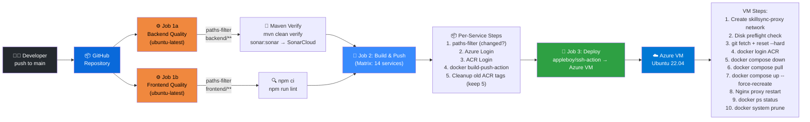
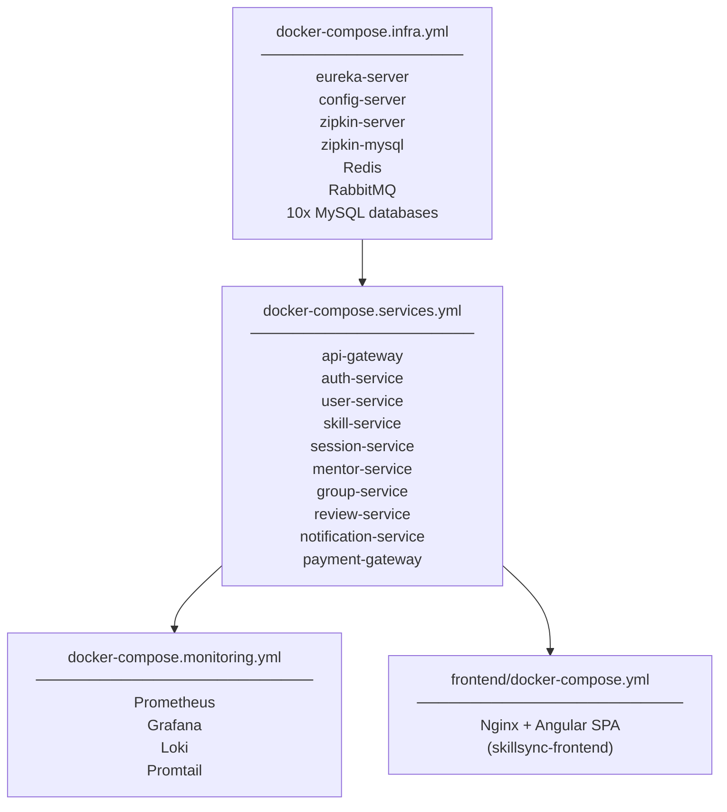

# SkillSync — Deployment & Pipeline Architecture

> **Version:** 1.0.0 | **Last Updated:** April 2026

---

## 1. Deployment Overview

SkillSync is deployed on **Azure** using a single Ubuntu 22.04 VM for the production environment. All services run as Docker containers orchestrated via Docker Compose. The CI/CD pipeline is powered by **GitHub Actions** with automated build, quality analysis, image publishing to **Azure Container Registry (ACR)**, and SSH-based deployment to the Azure VM.

---

## 2. CI/CD Pipeline Diagram

> *(The pipeline image could not be auto-generated due to image quota limits. See the Mermaid diagram below.)*



---

## 3. Pipeline Jobs Detail

### 3.1 Job 1a — Backend Quality Check

```yaml
runs-on: ubuntu-latest
triggers: push to main where backend/** changed (or force_rebuild=true)

steps:
  1. actions/checkout@v4         (fetch-depth: 0 for SonarCloud blame)
  2. dorny/paths-filter@v3       (check if backend/** changed)
  3. actions/setup-java@v4       (JDK 21, Temurin, Maven cache)
  4. mvn clean verify sonar:sonar
       -Dsonar.projectKey=SriramAkula_SkillSync
       -Dsonar.organization=sriramakula
       -Dsonar.host.url=https://sonarcloud.io
       -Dsonar.login=${{ secrets.SONAR_TOKEN }}
```

### 3.2 Job 1b — Frontend Quality Check

```yaml
runs-on: ubuntu-latest
triggers: push to main where frontend/** changed (or force_rebuild=true)

steps:
  1. actions/checkout@v4
  2. dorny/paths-filter@v3        (check if frontend/** changed)
  3. actions/setup-node@v4        (Node.js 18)
  4. npm ci                       (clean install)
  5. npm run lint                 (ESLint)
```

### 3.3 Job 2 — Build & Push (Matrix Strategy)

```yaml
needs: [backend-quality, frontend-quality]
strategy:
  fail-fast: false
  matrix:
    service:
      - api-gateway, auth-service, user-service, skill-service
      - session-service, mentor-service, group-service, review-service
      - notification-service, payment-gateway
      - eureka-server, config-server, frontend

per-service steps:
  1. dorny/paths-filter           (check if this service changed)
  2. azure/login@v2               (AZURE_CREDENTIALS secret)
  3. azure/docker-login@v1        (ACR_LOGIN_SERVER/USERNAME/PASSWORD secrets)
  4. docker/build-push-action@v5  (push: true, tags: :latest + :$SHA)
  5. az acr repository delete     (keep latest 5 tags; delete older ones)
```

**Image naming convention:**
```
skillsyncadmin.azurecr.io/skillsync-<service>:latest
skillsyncadmin.azurecr.io/skillsync-<service>:<git-sha>
```

### 3.4 Job 3 — Deploy to Azure VM

```yaml
needs: build-and-push
uses: appleboy/ssh-action@v1.0.3
SSH credentials: VM_IP, VM_USER, VM_SSH_KEY

Remote script (in order):
  1.  docker network create skillsync-proxy || true
  2.  FREE=$(df / --output=avail -h | tail -1)
      if FREE < 1GB: emergency docker system prune -af
  3.  [FORCE_REBUILD only]: purge container logs, apt cache, /tmp, docker system prune
  4.  rm -f .git/index.lock
      git fetch origin main
      git reset --hard origin/main
  5.  docker login ACR (using ACR_PASSWORD pipe)
  6.  docker compose [infra + monitoring + services + frontend] down
  7.  docker compose pull (latest images)
  8.  docker compose up -d --force-recreate --remove-orphans
  9.  [if nginx-proxy dir exists]: docker compose down && pull && up
  10. docker ps --format "table {{.Names}}\t{{.Status}}\t{{.Ports}}"
  11. df -h /
  12. docker system prune -af  (post-deploy cleanup)
```

### 3.5 Manual Trigger (Force Rebuild)

Available via **workflow_dispatch** with `force_rebuild: true`:
- Bypasses all path filters — rebuilds ALL 14 services
- Runs aggressive VM cleanup (Docker logs, apt cache, temp files)
- Useful after: base image updates, network reconfiguration, stale container state

---

## 4. Secrets Configuration

| GitHub Secret | Used By | Description |
|--------------|---------|-------------|
| `AZURE_CREDENTIALS` | Build job | Azure service principal JSON |
| `ACR_LOGIN_SERVER` | Build + Deploy | e.g., `skillsyncadmin.azurecr.io` |
| `ACR_LOGIN_SERVER_NAME` | Build (ACR cleanup) | e.g., `skillsyncadmin` |
| `ACR_USERNAME` | Build job | ACR username |
| `ACR_PASSWORD` | Build + Deploy | ACR password |
| `VM_IP` | Deploy job | Azure VM public IP |
| `VM_USER` | Deploy job | SSH username (e.g., `azureuser`) |
| `VM_SSH_KEY` | Deploy job | Private SSH key for VM access |
| `SONAR_TOKEN` | Quality job | SonarCloud auth token |
| `GITHUB_TOKEN` | Quality job | Auto-provided by GitHub Actions |

---

## 5. Azure VM Infrastructure

### 5.1 VM Specifications

| Resource | Configuration |
|---------|--------------|
| **OS** | Ubuntu 22.04 LTS |
| **CPU** | 2+ vCPU (recommended: 4 vCPU for all services) |
| **RAM** | 8 GB minimum (16 GB recommended) |
| **Disk** | 50 GB+ SSD |
| **Ports Open** | 80 (HTTP), 443 (HTTPS), 9090 (API Gateway direct) |

### 5.2 Directory Layout on VM

```
/home/azureuser/
├── SkillSync/              ← Git clone of repository
│   ├── backend/
│   │   ├── docker-compose.infra.yml       (MySQL, Redis, RabbitMQ, Eureka, Config, Zipkin)
│   │   ├── docker-compose.services.yml    (All 11 microservices)
│   │   ├── docker-compose.monitoring.yml  (Prometheus, Grafana, Loki, Promtail)
│   │   └── .env                           ← Runtime secrets (NOT in git)
│   └── frontend/
│       └── docker-compose.yml             (Angular Nginx container)
└── nginx-proxy/            ← External Nginx reverse proxy (managed separately)
    ├── docker-compose.yml
    └── nginx.conf          ← Routes HTTPS → skillsync-proxy Docker network
```

### 5.3 Docker Networks

```
skillsync-proxy   (external: true, driver: bridge)
  ├── Nginx proxy container (nginx-proxy/)
  ├── api-gateway           (port 9090, only internal)
  ├── auth-service          (proxy-network + private-network)
  ├── notification-service  (proxy-network + private-network)
  ├── payment-gateway       (proxy-network + private-network)
  ├── config-server         (proxy-network + private-network)
  ├── eureka-server         (proxy-network + private-network)
  ├── grafana               (proxy-network + private-network)
  └── zipkin-server         (proxy-network + private-network)

skillsync-private (internal: true, driver: bridge)  ← ALL services are on this
  ├── All microservices (inter-service communication)
  ├── MySQL databases (per-service)
  ├── Redis
  ├── RabbitMQ
  ├── Prometheus
  └── Loki + Promtail
```

---

## 6. Docker Compose Stack Architecture

The system is split into 4 Docker Compose files for separation of concerns:



**Startup Order (dependency chain):**
```
Redis, RabbitMQ, MySQL DBs (healthcheck)
         ↓
    Eureka Server
         ↓
    Config Server (healthcheck: curl /actuator/health)
         ↓
    All Microservices (health on config-server + their DB + rabbitmq)
         ↓
    API Gateway
         ↓
    Frontend (independent, talks only to API Gateway)
```

---

## 7. Service Container Configuration

Each microservice container has:

```yaml
restart: unless-stopped
networks:
  - private-network        # Always (inter-service comms)
  - proxy-network          # Only for services needing external access

logging:
  driver: "json-file"
  options:
    max-size: "10m"
    max-file: "3"

ulimits:
  nofile:
    soft: 65536
    hard: 65536
```

---

## 8. Monitoring Stack

### 8.1 Prometheus Scrape Config

```yaml
# prometheus.yml
scrape_configs:
  - job_name: 'skillsync-services'
    static_configs:
      - targets:
          - auth-service:8081
          - user-service:8082
          - skill-service:8083
          - session-service:8084
          - mentor-service:8085
          - group-service:8086
          - review-service:8087
          - notification-service:8088
          - payment-gateway:8089
          - api-gateway:9090
    metrics_path: /actuator/prometheus
    scrape_interval: 15s
```

### 8.2 Grafana Dashboards

| Dashboard | Metrics |
|-----------|--------|
| JVM Overview | Heap usage, GC, threads, CPU per service |
| HTTP Requests | Request rate, latency percentiles (p50/p95/p99), error rate |
| RabbitMQ | Queue depth, message rate, consumer lag |
| MySQL | Connection pool, query duration |
| Business | Sessions booked per hour, active users, payment success rate |

### 8.3 Log Stack (Loki)

```
Docker container stdout/stderr
    └─► Promtail (label: container_name, image)
        └─► Loki (store: local filesystem with retention)
            └─► Grafana → Explore → Loki (query by container_name)
```

All services use `logstash-logback-encoder` for structured JSON logs:
```json
{
  "timestamp": "2026-04-15T10:00:00Z",
  "level": "INFO",
  "logger": "com.skillsync.session.service",
  "message": "Session booked",
  "traceId": "abc123",
  "spanId": "def456"
}
```

### 8.4 Distributed Tracing (Zipkin)

- All services: `micrometer-tracing-bridge-brave` → reports to Zipkin
- Zipkin stores traces in MySQL (`zipkin` database)
- RabbitMQ messages carry trace headers for end-to-end trace correlation
- Access: `http://<vm-ip>:9411`

---

## 9. SSL / HTTPS Setup

```
Internet (HTTPS :443)
    ↓
Nginx (nginx-proxy/ — separate from SkillSync compose)
    ├── SSL: Let's Encrypt (Certbot) → /etc/letsencrypt/live/skillsync.me/
    ├── Proxy pass → api-gateway:9090 (via skillsync-proxy Docker network)
    ├── Proxy pass → frontend (skillsync-frontend container)
    └── WebSocket upgrade: Upgrade: websocket, Connection: $connection_upgrade
```

---

## 10. Environment Variables (.env)

The `backend/.env` file (not in git — must be created on VM):

```bash
# Spring profiles
SPRING_PROFILES_ACTIVE=prod

# Eureka
EUREKA_DEFAULT_ZONE=http://eureka-server:8761/eureka/

# Config Server Git repo
CONFIG_REPO_URI=https://github.com/your-org/skillsync-config-repo
CONFIG_REPO_USERNAME=<github-user>
CONFIG_REPO_PASSWORD=<github-pat>

# MySQL (all services use same root)
MYSQL_ROOT_PASSWORD=<strong-password>
MYSQL_ROOT_HOST=%

# Redis
REDIS_HOST=redis
REDIS_PORT=6379

# RabbitMQ
RABBITMQ_HOST=rabbitmq
RABBITMQ_PORT=5672
RABBITMQ_USERNAME=guest
RABBITMQ_PASSWORD=guest

# JWT
JWT_SECRET=<256-bit-secret>
JWT_EXPIRY_MS=3600000

# Zipkin MySQL
ZIPKIN_MYSQL_ROOT_PASSWORD=<password>
ZIPKIN_MYSQL_DATABASE=zipkin
ZIPKIN_MYSQL_USER=zipkin
ZIPKIN_MYSQL_PASSWORD=<password>

# Grafana
GRAFANA_ADMIN_USER=admin
GRAFANA_ADMIN_PASSWORD=<password>

# Payment (Razorpay)
RAZORPAY_KEY_ID=<key>
RAZORPAY_KEY_SECRET=<secret>

# Google OAuth
GOOGLE_CLIENT_ID=<client-id>
```

---

## 11. SonarCloud Code Quality

| Configuration | Value |
|--------------|-------|
| Project Key | `SriramAkula_SkillSync` |
| Organization | `sriramakula` |
| Host | `https://sonarcloud.io` |
| Coverage Tool | JaCoCo (per-service `jacoco-maven-plugin`) |
| Quality Gate | >75% line coverage |
| Exclusions | `**/dto/**`, `**/entity/**`, `**/config/**`, `**/*Application.java` |

---

## 12. Rollback Strategy

In case of a failed deployment:

```bash
# On Azure VM
cd /home/azureuser/SkillSync

# Option 1: Rollback to previous git commit
git log --oneline -5
git reset --hard <previous-sha>

# Option 2: Pull specific ACR image version
docker pull skillsyncadmin.azurecr.io/skillsync-auth-service:<sha>

# Option 3: Force restart from last known good state
docker compose -f backend/docker-compose.services.yml restart auth-service
```

---

## 13. Health Check URLs

```bash
# Service health (after deployment)
for port in 8081 8082 8083 8084 8085 8086 8087 8088 8089 8090 9090 8761 8888; do
  echo "Port $port: $(curl -s http://localhost:$port/actuator/health | jq -r '.status')"
done

# Eureka registered services
curl http://localhost:8761/eureka/apps | grep '<status>'

# RabbitMQ status
docker exec rabbitmq rabbitmq-diagnostics status

# Docker container overview
docker ps --format "table {{.Names}}\t{{.Status}}\t{{.Ports}}"
```

---

*For system architecture details, see [HLD.md](./HLD.md)*
*For component-level design, see [LLD.md](./LLD.md)*
