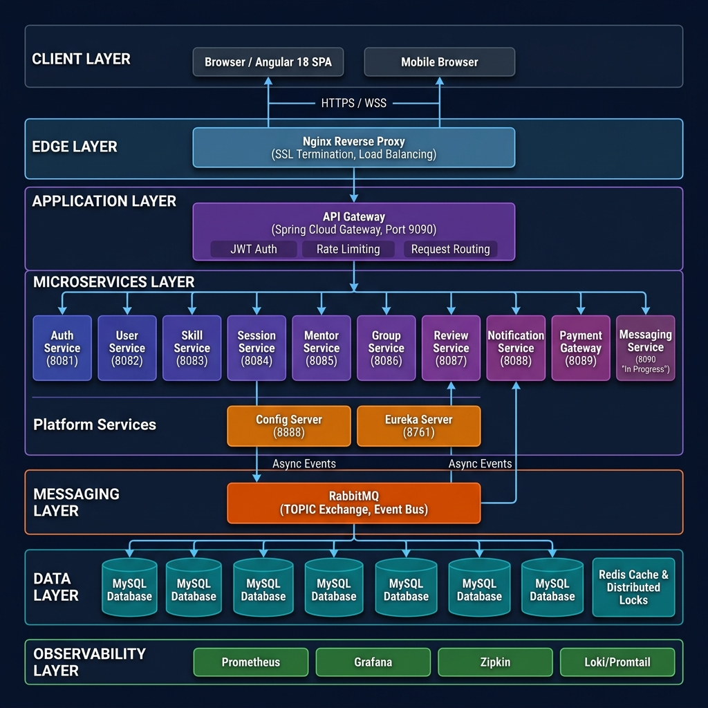

# SkillSync — High Level Design (HLD)

> **Version:** 1.0.0 | **Last Updated:** April 2026 | **Status:** Production Ready

---

## 1. System Overview

SkillSync is a cloud-native, microservices-based **Mentor-Learner Platform** that connects skilled mentors with eager learners. The system enables learners to discover mentors, book 1-on-1 sessions, collaborate in study groups, submit reviews, and process payments — all within a single cohesive platform.

### Core User Roles

| Role | Capabilities |
|------|-------------|
| **Learner** | Discover mentors, book sessions, join groups, submit reviews, make payments |
| **Mentor** | Manage profile & availability, accept/reject sessions, view ratings |
| **Admin** | User moderation (block/unblock), mentor approval, system-wide analytics |

---

## 2. Architecture Diagram



---

## 3. Architectural Style

SkillSync follows a **microservices architecture** with the following key design principles:

- **Database-per-Service**: Each microservice owns its private MySQL database (no shared schema)
- **API Gateway Pattern**: Single entry point for all client requests; handles JWT validation, rate limiting, and routing
- **Event-Driven Communication**: RabbitMQ TOPIC exchange for async, decoupled inter-service communication
- **Synchronous Communication**: Feign Clients for request/response patterns where strong consistency is needed
- **CQRS Pattern**: Command-Query Responsibility Segregation in Session services
- **Circuit Breaker**: Resilience4j for fault tolerance on Feign calls

---

## 4. System Layers

### 4.1 Client Layer

| Component | Technology | Description |
|-----------|-----------|-------------|
| Web SPA | Angular 18 | Single-page application with NgRx Signals state management |
| Styling | Tailwind CSS 3.3 + Angular Material | Responsive, accessible UI |
| State | NgRx Signal Store | Reactive, signal-based state management |
| Auth | JWT (localStorage) + Auth Interceptor | Token refresh & injection on every request |

**Client connects to backend via:**
- `HTTPS` — REST API calls

### 4.2 Edge Layer

| Component | Technology | Description |
|-----------|-----------|-------------|
| Reverse Proxy | Nginx | SSL termination, WebSocket upgrade headers, static file serving |
| SSL | Let's Encrypt (Certbot) | Automatic certificate renewal |
| Networks | Docker `skillsync-proxy` + `skillsync-private` | Isolated bridge networks |

**Network Topology:**
- `skillsync-proxy` (external): Nginx ↔ API Gateway ↔ services that need external reach
- `skillsync-private` (internal, isolated): All inter-service communication

### 4.3 API Gateway Layer

| Feature | Configuration |
|---------|-------------|
| Framework | Spring Cloud Gateway |
| Port | 9090 |
| Auth | JWT validation filter (`GatewayRequestFilter`) extracts `userId` → adds `X-User-Id` header |
| Routing | Path-based predicates (`/api/auth/**`, `/api/users/**`, etc.) |
| Discovery | Eureka-backed load-balanced routing (`lb://service-name`) |

### 4.4 Microservices Layer

| Service | Port | Database | Key Responsibilities |
|---------|------|----------|---------------------|
| **Auth Service** | 8081 | `skill_auth` | JWT generation/validation, OAuth2 Google, OTP via email, password reset, audit logging |
| **User Service** | 8082 | `skill_user` | User profiles, blocking/unblocking, role management, Redis caching |
| **Skill Service** | 8083 | `skill_skill` | Skill catalog, categories, search, Redis caching |
| **Session Service** | 8084 | `skill_session` | Booking workflow (CQRS), Redis distributed locks (double-booking prevention), event publishing |
| **Mentor Service** | 8085 | `skill_mentor` | Mentor profiles, availability, skill linking, Feign → User/Skill services |
| **Group Service** | 8086 | `skill_group` | Study group CRUD, membership management |
| **Review Service** | 8087 | `skill_review` | Session reviews, star ratings, triggers Mentor rating update via event |
| **Notification Service** | 8088 | `skill_notification` | RabbitMQ consumer, email dispatch (SMTP), notification history |
| **Payment Gateway** | 8089 | `skill_payment` | Razorpay integration, order creation, webhook verification |

### 4.5 Platform Services

| Service | Port | Purpose |
|---------|------|---------|
| **Config Server** | 8888 | Spring Cloud Config Server; fetches service configs from Git repo |
| **Eureka Server** | 8761 | Spring Cloud Netflix Eureka; service registry & discovery |

### 4.6 Messaging Infrastructure Layer

**RabbitMQ** is the event backbone with two exchange types:

| Exchange Type | Used By | Purpose |
|--------------|---------|---------|
| **TOPIC Exchange** | Session Service, Review Service | Fan-out events to multiple consumers (Notification, Mentor services) |

### 4.7 Data Layer

| Store | Configuration | Purpose |
|-------|-------------|---------|
| **MySQL 8.0** | 10 isolated databases (one per service) | Persistent relational data storage |
| **Redis 7** | Single instance | Profile/skill caching (10min TTL), distributed session locks (30s TTL) |
| **Zipkin MySQL** | Separate `zipkin` database | Distributed trace storage |

### 4.8 Observability Layer

| Tool | Port | Purpose |
|------|------|---------|
| **Prometheus** | — (internal) | Metrics scraping from `/actuator/prometheus` on each service |
| **Grafana** | 3000 | Dashboards for JVM, HTTP, and business metrics |
| **Zipkin** | 9411 | Distributed request tracing (Micrometer Brave bridge) |
| **Loki** | 3100 | Log aggregation and storage |
| **Promtail** | — | Log shipping from Docker containers → Loki |

---

## 5. Communication Patterns

### 5.1 Synchronous (Feign Client)

```
Frontend → API Gateway → Service A → Feign → Service B
```

Used for: Real-time user data lookups (e.g., Messaging Service → User Service for profile validation)

**Resilience:** Resilience4j Circuit Breaker with fallback factory patterns.

### 5.2 Asynchronous (RabbitMQ Events)

```
Service A → RabbitMQ TOPIC Exchange → [Service B, Service C, ...]
```

**Key Event Flows:**

```
Session Service ──► SessionRequestedEvent  ──► Notification Service (email to mentor)
Session Service ──► SessionAcceptedEvent   ──► Notification Service (email to learner)
Session Service ──► SessionRejectedEvent   ──► Notification Service
Session Service ──► SessionCancelledEvent  ──► Notification Service
Review Service  ──► ReviewSubmittedEvent   ──► Notification Service + Mentor Service (rating update)
Auth Service    ──► UserCreatedEvent       ──► User Service (profile creation)
Auth Service    ──► UserUpdatedEvent       ──► User Service (profile sync)
```

---

## 6. Security Architecture

### 6.1 Authentication Flow

```
1. POST /api/auth/login  →  Auth Service validates credentials
2. Auth Service          →  Generates JWT (userId, role, expiry) + Refresh Token (Redis)
3. Frontend stores JWT   →  localStorage (access token)
4. Every API call        →  Authorization: Bearer <JWT>
5. API Gateway Filter    →  Validates JWT, extracts userId → X-User-Id header
6. Downstream Service    →  Trusts X-User-Id (no token re-validation needed)
```

### 6.2 Authorization Model

| Role | Key Permissions |
|------|----------------|
| `ROLE_LEARNER` | View mentors, book sessions, join groups, submit reviews, pay |
| `ROLE_MENTOR` | Manage profile, accept/reject sessions, update availability, view reviews |
| `ROLE_ADMIN` | Block/unblock users, approve mentors, moderate reviews |

### 6.3 Internal Service Security

- `GatewayRequestFilter` in each service enforces the `X-User-Id` header presence (requests without it are rejected — meaning no direct service access is possible, only through the gateway)
- Auth Service has an additional `InternalServiceFilter` for internal Feign calls using a shared secret header

---

## 7. Deployment Model

> See [Deployment Architecture](./DEPLOYMENT_ARCHITECTURE.md) for full diagram and pipeline details.

### 7.1 Container Strategy

All services are containerized with **multi-stage Dockerfiles**:
1. **Build stage**: Maven/Node build
2. **Runtime stage**: Minimal JRE/Nginx image

Images are pushed to **Azure Container Registry (ACR)** and pulled by the Azure VM.

### 7.2 Docker Network Architecture

```
┌─────────────────────────────────────────────────────┐
│  skillsync-proxy (external bridge)                  │
│  ┌───────────┐  ┌────────────┐  ┌────────────────┐  │
│  │  Nginx    │  │ API Gateway│  │ Config Server  │  │
│  │  (host)   │  │   :9090   │  │    :8888       │  │
│  └───────────┘  └────────────┘  └────────────────┘  │
└─────────────────────────────────────────────────────┘
           │ (also on proxy-network)
┌─────────────────────────────────────────────────────┐
│  skillsync-private (internal-only bridge)           │
│  All microservices, databases, Redis, RabbitMQ      │
│  ❌ Not reachable from outside Docker               │
└─────────────────────────────────────────────────────┘
```

---

## 8. Scalability Considerations

| Concern | Strategy |
|---------|---------|
| **Session double-booking** | Redis `SET NX EX` distributed lock + MySQL UNIQUE INDEX |
| **Service discovery** | Eureka server-side load balancing + Spring Cloud LoadBalancer |
| **Config hot-reload** | Spring Cloud Config Server with Git backend |
| **Horizontal scaling** | `docker compose up --scale session-service=3` (auto load-balanced via Eureka) |
| **Caching** | Redis TTL-based caching on user/mentor/skill profiles |
| **Fault tolerance** | Resilience4j circuit breakers on all Feign clients |

---

## 9. Key Non-Functional Requirements (NFRs)

| NFR | Implementation |
|-----|---------------|
| **Security** | JWT HS256, HTTPS/TLS, role enforcement, internal-only network |
| **Reliability** | Docker `restart: unless-stopped`, health checks, circuit breakers |
| **Observability** | Distributed tracing (Zipkin), metrics (Prometheus/Grafana), centralized logs (Loki) |
| **Maintainability** | SonarCloud quality gate (>75% coverage), ESLint, standardized API response format |
| **Portability** | Full Docker Compose stack; runs on any Docker-enabled Linux VM |

---

## 10. Technology Stack Summary

### Backend
| Technology | Version | Purpose |
|-----------|---------|---------|
| Spring Boot | 3.4.11 | Microservices framework |
| Java | 17 LTS | Core language |
| Spring Cloud | 2024.0.0 | Discovery, Config, Gateway |
| Spring Data JPA | — | ORM (Hibernate) |
| Spring AMQP | — | RabbitMQ integration |
| Spring Data Redis | — | Cache & locks |
| OpenFeign | — | Declarative HTTP client |
| Resilience4j | — | Circuit breaker |
| Micrometer | — | Metrics + Zipkin tracing |
| Lombok | 1.18.40 | Boilerplate reduction |
| springdoc-openapi | 2.8.8 | Swagger UI |

### Frontend
| Technology | Version | Purpose |
|-----------|---------|---------|
| Angular | 18.0 | SPA framework |
| NgRx Signals | 18.0 | Signal-based state management |
| RxJS | 7.8 | Reactive programming |
| TypeScript | 5.4 | Type safety |
| Tailwind CSS | 3.3 | Utility-first CSS |
| Angular Material | 18.0 | UI component library |

### DevOps & Infrastructure
| Technology | Purpose |
|-----------|---------|
| Docker + Docker Compose | Containerization & orchestration |
| Azure Container Registry | Docker image registry |
| Azure VM (Ubuntu 22.04) | Production hosting |
| GitHub Actions | CI/CD pipeline |
| SonarCloud | Code quality analysis |
| Nginx | Reverse proxy + SSL termination |

---

*For detailed component-level design, see [LLD.md](./LLD.md)*
*For deployment and pipeline details, see [DEPLOYMENT_ARCHITECTURE.md](./DEPLOYMENT_ARCHITECTURE.md)*
