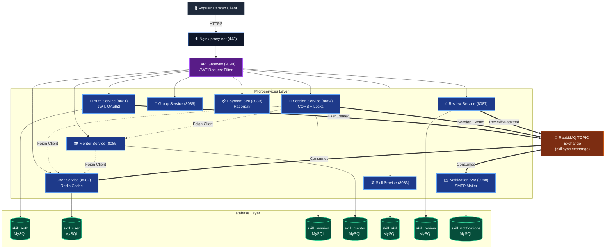

# SkillSync — Low Level Design (LLD)

> **Version:** 1.0.0 | **Last Updated:** April 2026

---

## 1. Overview

This document provides a detailed low-level technical design for each microservice in the SkillSync platform, covering internal class structures, CQRS patterns, REST API contracts, entity schemas, RabbitMQ event flows, and inter-service communication.

---

## 2. Architecture Diagram (Full Application)

> *(Note: The image generator quota was reached, so an interactive Mermaid diagram is provided below detailing the interactions across all microservices, excluding the messaging service as requested.)*



---

## 3. Cross-Cutting Concerns (Applied to All Services)

### 3.1 Request Validation Filter

Every downstream service (except Auth) contains a `GatewayRequestFilter`:

```java
// Validates that the request came through the API Gateway
// by checking for the X-User-Id header
X-User-Id: <userId>   ← injected by API Gateway JWT filter
X-User-Role: <role>   ← injected by API Gateway
```

### 3.2 Standard API Response Shape

```json
// Success
{ "success": true, "data": { ... }, "message": "Operation successful", "statusCode": 200 }

// Error
{ "success": false, "error": "...", "message": "User-friendly message", "statusCode": 400 }

// Paged
{ "content": [...], "page": 0, "size": 10, "totalElements": 100, "totalPages": 10 }
```

### 3.3 Distributed Tracing

All services use `micrometer-tracing-bridge-brave` + `zipkin-reporter-brave`:
- TraceId/SpanId injected into every log line via `logstash-logback-encoder`
- RabbitMQ messages carry trace propagation headers (via `setObservationEnabled(true)` on RabbitTemplate)

### 3.4 Metrics Endpoint

All services expose:
```
GET /actuator/health      → Health check (used by Docker healthcheck)
GET /actuator/prometheus  → Prometheus scrape endpoint (Micrometer)
```

### 3.5 Audit Logging

Auth Service and Session Service implement `AuditLog` entities:
```
AuditLog { id, entityType, entityId, action, performedBy, timestamp }
```

---

## 4. Auth Service (Port 8081)

### 4.1 Responsibilities
- User registration with OTP email verification
- Login (email/password + Google OAuth2)
- JWT access token generation (HS256)
- Refresh token management (Redis)
- Password reset via OTP
- Publishing `UserCreatedEvent` and `UserUpdatedEvent` to RabbitMQ

### 4.2 Internal Package Structure

```
com.skillsync.authservice
├── controller/
│   ├── AuthController              # POST /auth/*, /oauth2/google
│   └── internal/InternalUserController  # Feign endpoint for Auth→User lookups
├── service/
│   ├── AuthService (interface)
│   ├── AuthServiceImpl             # Core auth logic
│   ├── OAuthService                # Google token verification
│   └── OtpService                  # OTP generation & Redis storage
├── security/
│   ├── JwtUtil                     # JWT sign/validate/parse
│   ├── JwtFilter                   # OncePerRequestFilter (validates JWT on every request)
│   ├── CustomUserDetails           # UserDetails adapter
│   ├── CustomUserDetailsService    # Loads user from DB by email
│   ├── InternalServiceFilter       # Validates X-Internal-Secret header for Feign calls
│   └── SecurityExceptionHandler    # AuthenticationEntryPoint + AccessDeniedHandler
├── publisher/
│   └── AuthEventPublisher          # Publishes UserCreatedEvent, UserUpdatedEvent to RabbitMQ
├── config/
│   ├── RabbitMQConfig              # TOPIC exchange: skillsync.auth.exchange
│   ├── RedisConfig                 # Refresh token store (TTL: 7 days)
│   ├── SecurityConfig              # SecurityFilterChain - permits /auth/login, /auth/register
│   └── JwtConfig                   # JWT secret + expiry from config server
├── audit/
│   └── AuditService, AuditLog      # Logs all auth events to audit_logs table
└── entity/
    └── User { id, email, passwordHash, role, authProvider, isVerified, isBlocked }
```

### 4.3 REST API Contract

| Method | Path | Auth | Description |
|--------|------|------|-------------|
| `POST` | `/api/auth/register` | Public | Register with email; triggers OTP email |
| `POST` | `/api/auth/verify-otp` | Public | Verify OTP, activates account |
| `POST` | `/api/auth/login` | Public | Email/password login → JWT |
| `POST` | `/api/auth/oauth2/google` | Public | Google token → JWT |
| `POST` | `/api/auth/refresh-token` | Bearer | Rotate JWT using refresh token |
| `POST` | `/api/auth/forgot-password` | Public | Sends reset OTP |
| `POST` | `/api/auth/reset-password` | Public | Resets password with OTP |
| `GET`  | `/api/auth/profile` | Bearer | Get own auth profile |
| `PUT`  | `/api/auth/profile` | Bearer | Update name/avatar (syncs to User Service) |

### 4.4 RabbitMQ Events Published

| Event | Exchange | Routing Key | Payload |
|-------|----------|-------------|---------|
| `UserCreatedEvent` | `skillsync.auth.exchange` (TOPIC) | `user.created` | `{userId, email, name, role}` |
| `UserUpdatedEvent` | `skillsync.auth.exchange` (TOPIC) | `user.updated` | `{userId, name, avatarUrl}` |

### 4.5 Entity Schema

```sql
-- Auth DB: skill_auth
CREATE TABLE users (
    id            BIGINT PRIMARY KEY AUTO_INCREMENT,
    email         VARCHAR(255) UNIQUE NOT NULL,
    password_hash VARCHAR(255),
    name          VARCHAR(255),
    role          ENUM('ROLE_LEARNER', 'ROLE_MENTOR', 'ROLE_ADMIN') NOT NULL,
    auth_provider ENUM('LOCAL', 'GOOGLE') DEFAULT 'LOCAL',
    is_verified   BOOLEAN DEFAULT FALSE,
    is_blocked    BOOLEAN DEFAULT FALSE,
    created_at    TIMESTAMP DEFAULT CURRENT_TIMESTAMP,
    updated_at    TIMESTAMP DEFAULT CURRENT_TIMESTAMP ON UPDATE CURRENT_TIMESTAMP
);
```

---

## 5. User Service (Port 8082)

### 4.1 Responsibilities
- User profile management (bio, avatar, skills, location)
- User search and paginated listing
- Block/unblock users (admin)
- Caches profiles in Redis (TTL: 10 min)
- Listens to `UserCreatedEvent` / `UserUpdatedEvent` from Auth Service

### 5.2 Internal Package Structure

```
com.skillsync.userservice
├── controller/
│   └── UserController             # GET/PUT /api/users/*, admin operations
├── service/
│   ├── UserService (interface)
│   └── UserServiceImpl            # Profile CRUD + Redis cache-aside
├── config/
│   ├── RabbitMQConfig             # Declares queue: user.queue, binds to auth.exchange
│   └── RedisConfig                # user_profile_{userId} keys
├── consumer/
│   └── AuthEventConsumer          # @RabbitListener for UserCreatedEvent/UserUpdatedEvent
└── entity/
    └── UserProfile { userId, name, email, bio, avatarUrl, location, role, isBlocked }
```

### 5.3 REST API Contract

| Method | Path | Auth | Description |
|--------|------|------|-------------|
| `GET` | `/api/users/{id}` | Bearer | Get user profile |
| `GET` | `/api/users/me` | Bearer | Get own profile |
| `PUT` | `/api/users/me` | Bearer | Update own profile |
| `GET` | `/api/users?search=&page=&size=` | Bearer | Search users |
| `PUT` | `/api/users/{id}/block` | Admin | Block user |
| `PUT` | `/api/users/{id}/unblock` | Admin | Unblock user |

### 5.4 Redis Cache Keys

```
user_profile_{userId}   → UserProfileDTO (TTL: 10 minutes)
```

---

## 6. Session Service (Port 8084)

### 6.1 Responsibilities
- Learner books a session with a mentor (CQRS: command vs query separation)
- Double-booking prevented via Redis lock + MySQL UNIQUE index
- Publishes lifecycle events: `SessionRequested`, `SessionAccepted`, `SessionRejected`, `SessionCancelled`
- Feign call to User Service for participant details in responses

### 6.2 CQRS Pattern

```
SessionController
    │
    ├─► SessionCommandService  (writes: book, accept, reject, cancel)
    │       └─► SessionRepository (JPA write)
    │       └─► Redis distributed lock
    │       └─► SessionEventPublisher (RabbitMQ)
    │
    └─► SessionQueryService    (reads: history, detail, paginated list)
            └─► SessionRepository (JPA read)
            └─► UserClient (Feign → User Service)
```

### 6.3 Double-Booking Prevention

```java
// 1. Redis Distributed Lock (30-second TTL)
String lockKey = "session-lock:" + mentorId + ":" + scheduledAt;
Boolean acquired = redisTemplate.opsForValue()
    .setIfAbsent(lockKey, "locked", 30, TimeUnit.SECONDS);

// 2. Database UNIQUE constraint (backup)
CREATE UNIQUE INDEX unique_session_booking
ON sessions (mentor_id, scheduled_at)
WHERE status IN ('REQUESTED', 'ACCEPTED');
```

### 6.4 RabbitMQ Events Published

| Event | Routing Key | Consumers |
|-------|-------------|-----------|
| `SessionRequestedEvent` | `session.requested` | Notification Service |
| `SessionAcceptedEvent` | `session.accepted` | Notification Service |
| `SessionRejectedEvent` | `session.rejected` | Notification Service |
| `SessionCancelledEvent` | `session.cancelled` | Notification Service |

### 6.5 Entity Schema

```sql
-- Session DB: skill_session
CREATE TABLE sessions (
    id              BIGINT PRIMARY KEY AUTO_INCREMENT,
    learner_id      BIGINT NOT NULL,
    mentor_id       BIGINT NOT NULL,
    scheduled_at    DATETIME NOT NULL,
    duration_min    INT NOT NULL DEFAULT 60,
    topic           VARCHAR(500),
    status          ENUM('REQUESTED','ACCEPTED','REJECTED','CANCELLED','COMPLETED'),
    notes           TEXT,
    created_at      TIMESTAMP DEFAULT CURRENT_TIMESTAMP,
    UNIQUE KEY unique_booking (mentor_id, scheduled_at)
);
```

---

## 7. Notification Service (Port 8088)

### 8.1 Responsibilities
- Consumes all domain events from RabbitMQ TOPIC exchange
- Dispatches emails via SMTP (JavaMailSender, HTML Thymeleaf templates)
- Persists notification history in MySQL

### 8.2 Event Consumption

```java
@RabbitListener(queues = {
    "session.requested.queue",
    "session.accepted.queue",
    "session.rejected.queue",
    "review.submitted.queue"
})
public void handleEvent(Object event) { ... }
```

### 8.3 Email Templates (Thymeleaf HTML)

| Template | Trigger Event |
|----------|-------------|
| `session-requested.html` | Mentor receives new booking request |
| `session-accepted.html` | Learner's session was accepted |
| `session-rejected.html` | Learner's session was rejected |
| `review-submitted.html` | Mentor received a new review |
| `welcome.html` | New user registered |

---

## 8. Payment Gateway Service (Port 8089)

### 9.1 Responsibilities
- Creates Razorpay payment orders
- Verifies Razorpay webhook signatures (HMAC-SHA256)
- Stores payment records in MySQL
- Publishes `PaymentCompletedEvent` on success

### 9.2 REST API Contract

| Method | Path | Auth | Description |
|--------|------|------|-------------|
| `POST` | `/api/payments/create-order` | Bearer | Create Razorpay order for a session |
| `POST` | `/api/payments/verify` | Bearer | Verify payment signature |
| `GET` | `/api/payments/history` | Bearer | Get payment history |
| `POST` | `/api/payments/webhook` | Public | Razorpay webhook receiver |

---

## 9. API Gateway (Port 9090)

### 9.1 Route Configuration (via Config Server)

```yaml
spring:
  cloud:
    gateway:
      routes:
        - id: auth-service
          uri: lb://auth-service
          predicates: [Path=/api/auth/**]
          filters: [StripPrefix=0]
```

### 10.2 JWT Authentication Filter Logic

```
1. Extract Authorization header
2. Parse JWT (JwtUtil.validateToken)
3. Reject 401 if invalid/expired
4. Extract userId, role from claims
5. Mutate request: add X-User-Id, X-User-Role headers
6. Forward to downstream service
```

---

## 10. Frontend Angular 18 Architecture

### 11.1 Module Structure

```
src/app/
├── core/
│   ├── auth/           # AuthStore (NgRx Signal), AuthGuard, RoleGuard
│   ├── interceptors/   # AuthInterceptor (JWT injection), ErrorInterceptor
│   ├── guards/         # auth.guard.ts, role.guard.ts
│   └── services/       # UserService, SkillService, SessionService, etc.
├── features/
│   ├── auth/           # Login, Register, OTP, ForgotPassword pages
│   ├── mentors/        # MentorList, MentorDetail, ApplyMentor pages
│   ├── sessions/       # MySessions, MentorSessions, RequestSession, SessionDetail
│   ├── groups/         # GroupList, GroupDetail pages
│   ├── messaging/      # ChatPage, ConversationList, MessageThread, ChatStore
│   ├── reviews/        # MentorReviews page
│   ├── payment/        # Checkout page (Razorpay integration)
│   ├── notifications/  # NotificationList page
│   ├── profile/        # Profile, EditProfile pages
│   ├── skills/         # SkillList page
│   ├── admin/          # AdminUsers, PendingMentors, UserDetail (admin-only)
│   └── public/         # Home (landing page)
├── layout/
│   ├── navbar/         # NavbarComponent (role-aware navigation)
│   ├── sidebar/        # SidebarComponent
│   ├── shell/          # ShellComponent (authenticated layout wrapper)
│   └── theme-toggle/   # Dark/Light mode toggle
└── shared/
    ├── components/     # PaginationComponent, ToastComponent, ChatDrawer, Unauthorized
    ├── models/         # Page models, Skill models
    └── services/       # ToastService
```

### 10.2 State Management (NgRx Signals)

Each feature area has an independent signal store:

```typescript
// Example: AuthStore (simplified)
export const AuthStore = signalStore(
  withState<AuthState>({ user: null, token: null, loading: false }),
  withMethods((store, authService = inject(AuthService)) => ({
    login: rxMethod<LoginRequest>(/* ... */),
    logout: () => { /* clear state + localStorage */ }
  }))
);
```

### 10.3 HTTP Interceptor Chain

```
Request → AuthInterceptor (adds Bearer token) → API Gateway
Response ← ErrorInterceptor (handles 401 → token refresh, 403 → redirect)
```

### 10.4 Route Guards

```typescript
// Role-based guard example
export const roleGuard: CanActivateFn = (route) => {
  const requiredRole = route.data['role'];  // e.g., 'ROLE_ADMIN'
  const authStore = inject(AuthStore);
  return authStore.user()?.role === requiredRole;
};
```

---

## 11. Service Dependency Map

```
                    ┌─────────────────────────────────────────┐
                    │          Config Server (8888)           │
                    │    (All services fetch config here)     │
                    └───────────────┬─────────────────────────┘
                                    │
                    ┌───────────────▼─────────────────────────┐
                    │         Eureka Server (8761)            │
                    │    (All services register here)         │
                    └───────────────┬─────────────────────────┘
                                    │
              ┌─────────────────────▼──────────────────────────┐
              │           API Gateway (9090)                   │
              │    Routes to all services below                │
              └┬──────┬──────┬──────┬──────┬──────┬──────┬────┘
               │      │      │      │      │      │      │
            Auth   User   Skill  Session Mentor Group  Review
            8081   8082   8083   8084    8085   8086   8087
               │      ↑      ↑      │↓       ↑      │
               │      │      │  Redis Lock  Feign  Feign
               │      └──────┘      │↓             │
               └──RabbitMQ──────────►Notification─←─┘
                                    8088
               11. Service Dependency Map
```

---

*For system-level design, see [HLD.md](./HLD.md)*
*For deployment details, see [DEPLOYMENT_ARCHITECTURE.md](./DEPLOYMENT_ARCHITECTURE.md)*
