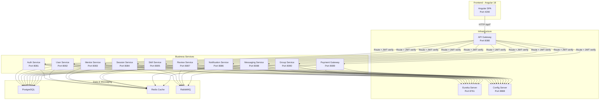

# SkillSync — Complete Project Mastery Guide

> **Purpose**: Everything you need to know to navigate, explain, and modify any part of the codebase during an evaluation.

---

## Table of Contents

1. [High-Level Architecture](#1-high-level-architecture)
2. [Full Project Directory Tree](#2-full-project-directory-tree)
3. [Backend: Service-by-Service Breakdown](#3-backend-service-by-service-breakdown)
4. [Backend: Standard Package Layout (Every Service)](#4-backend-standard-package-layout)
5. [Frontend: Complete Structure](#5-frontend-complete-structure)
6. [End-to-End Request Flows](#6-end-to-end-request-flows)
7. [Inter-Service Communication](#7-inter-service-communication)
8. [Design Patterns Used](#8-design-patterns-used)
9. [Quick-Find Cheat Sheet](#9-quick-find-cheat-sheet)
10. [API Endpoint → File Mapping](#10-api-endpoint--file-mapping)

---

## 1. High-Level Architecture



### How a Request Flows (The Big Picture)

```
User clicks "Login" button
    ↓
Angular LoginPage → AuthStore.login() → AuthService.login()
    ↓
HTTP POST /api/auth/login  (with JWT from localStorage via jwtInterceptor)
    ↓
API Gateway (port 8080) — JwtAuthenticationFilter
    → validates JWT (skips for public endpoints like /login)
    → extracts userId, email, roles from JWT
    → adds headers: X-User-Id, loggedInUser, roles
    → strips /api prefix, routes to auth-service
    ↓
Auth Service (port 8081) — AuthController.login()
    → AuthServiceImpl.login()
    → UserRepository.findByEmail()
    → BCrypt password verification
    → JwtUtil.generateToken() + generateRefreshToken()
    → AuthEventPublisher publishes USER_CREATED event to RabbitMQ
    → Returns AuthResponse(token, roles, userId)
    ↓
Response flows back through Gateway → Frontend
    ↓
AuthStore saves token to localStorage + navigates to /mentors
```

---

## 2. Full Project Directory Tree

```
SkillSync-Project/
├── frontend/                        ← Angular 18 SPA
│   └── src/app/
│       ├── app.config.ts            ← Registers providers (router, HTTP, interceptors)
│       ├── app.routes.ts            ← Top-level route definitions
│       ├── app.component.ts         ← Root component
│       ├── core/                    ← Singleton services/state (loaded once)
│       │   ├── auth/                ← NgRx Signal Stores (state management)
│       │   │   ├── auth.store.ts
│       │   │   ├── mentor.store.ts
│       │   │   ├── session.store.ts
│       │   │   ├── skill.store.ts
│       │   │   ├── notification.store.ts
│       │   │   └── payment.store.ts
│       │   ├── guards/              ← Route protection
│       │   │   └── auth.guard.ts
│       │   ├── interceptors/        ← HTTP middleware
│       │   │   ├── jwt.interceptor.ts
│       │   │   └── auth.interceptor.ts
│       │   └── services/            ← HTTP API services
│       │       ├── auth.service.ts
│       │       ├── user.service.ts
│       │       ├── mentor.service.ts
│       │       ├── session.service.ts
│       │       ├── skill.service.ts
│       │       ├── review.service.ts
│       │       ├── notification.service.ts
│       │       ├── messaging.service.ts
│       │       ├── payment.service.ts
│       │       ├── group.service.ts
│       │       ├── admin-user.service.ts
│       │       ├── api.service.ts
│       │       ├── theme.service.ts
│       │       ├── toast.service.ts
│       │       ├── local-notification.service.ts
│       │       └── profile-completion.service.ts
│       ├── features/                ← Lazy-loaded feature modules
│       │   ├── auth/pages/          ← Login, Register, OTP, Forgot Password
│       │   ├── mentors/pages/       ← Mentor List, Mentor Detail, Apply Mentor
│       │   ├── sessions/pages/      ← My Sessions, Request Session, Session Detail, Mentor Sessions
│       │   ├── skills/pages/        ← Skill List
│       │   ├── reviews/pages/       ← Reviews List
│       │   ├── notifications/pages/ ← Notification List
│       │   ├── messaging/pages/     ← Chat Page
│       │   ├── groups/pages/        ← Group List, Group Detail
│       │   ├── profile/pages/       ← Profile Page
│       │   ├── payment/pages/       ← Payment Page
│       │   ├── admin/pages/         ← Admin Users, Admin Mentors
│       │   └── public/pages/        ← Home (Landing Page)
│       ├── layout/                  ← App shell (navbar + sidebar)
│       │   ├── shell/
│       │   ├── navbar/
│       │   ├── sidebar/
│       │   └── theme-toggle/
│       └── shared/                  ← Reusable across features
│           ├── models/index.ts      ← ALL TypeScript interfaces/types
│           ├── components/          ← Shared UI components
│           └── services/            ← Shared utility services
│
├── backend/                         ← Spring Boot Microservices Monorepo
│   ├── pom.xml                      ← Parent POM (shared dependencies)
│   ├── docker-compose.infra.yml     ← PostgreSQL, Redis, RabbitMQ
│   ├── docker-compose.services.yml  ← All microservices
│   ├── prometheus.yml               ← Prometheus monitoring config
│   │
│   ├── eureka-server/               ← Service Registry
│   ├── config-server/               ← Centralized Configuration
│   ├── api-gateway/                 ← Entry point, JWT validation, routing
│   │
│   ├── auth-service/                ← Authentication & Authorization
│   ├── user-service/                ← User Profiles
│   ├── mentor-service/              ← Mentor Profiles & Applications
│   ├── session-service/             ← Session Requests & Management
│   ├── skill-service/               ← Skill CRUD
│   ├── review-service/              ← Reviews & Ratings
│   ├── notification-service/        ← Email & In-App Notifications
│   ├── messaging-service/           ← Chat Messages
│   ├── payment-gateway/             ← Razorpay Saga Orchestration
│   └── group-service/               ← Learning Groups
```

---

## 3. Backend: Service-by-Service Breakdown

### 3.1 Eureka Server (Port 8761)
**Purpose**: Service registry. Every microservice registers here so they can find each other by name instead of hardcoded URLs.
**Key File**: `EurekaServerApplication.java` — just `@SpringBootApplication` + `@EnableEurekaServer`
**Concept**: Service Discovery

---

### 3.2 Config Server (Port 8888)
**Purpose**: Centralized configuration. All `application.yml` files for every service are stored in `config-repo/` and served to services at startup.
**Key File**: `ConfigServerApplication.java` — `@EnableConfigServer` + `@EnableDiscoveryClient`
**Concept**: Externalized Configuration

---

### 3.3 API Gateway (Port 8080)
**Purpose**: Single entry point for the frontend. Validates JWT tokens, adds user identity headers, routes requests to correct microservice.

| File | What It Does |
|---|---|
| `ApiGatewayApplication.java` | Main class with `@EnableDiscoveryClient` |
| `filter/JwtAuthenticationFilter.java` | **THE MOST IMPORTANT FILE**. Global filter that: (1) skips public endpoints, (2) validates JWT, (3) extracts `userId`, `email`, `roles` from token, (4) adds `X-User-Id`, `loggedInUser`, `roles` headers for downstream services |
| `util/JwtUtil.java` | JWT parsing & validation (shared secret with auth-service) |
| `config/CorsConfig.java` | CORS settings (allows frontend origin) |
| `config/OpenApiConfig.java` | Aggregated Swagger docs from all services |
| `exception/GlobalErrorHandler.java` | Catches gateway-level errors |

**Concept**: API Gateway Pattern, JWT Authentication

---

### 3.4 Auth Service (Port 8081)
**Purpose**: User registration, login, OTP verification, password reset, Google OAuth, JWT generation.

| Package/File | What It Does |
|---|---|
| `controller/AuthController.java` | Endpoints: `/auth/login`, `/auth/register`, `/auth/send-otp`, `/auth/verify-otp`, `/auth/refresh`, `/auth/logout`, `/auth/forgot-password`, `/auth/reset-password`, `/auth/oauth/google` |
| `controller/internal/InternalUserController.java` | Internal endpoints called by other services via Feign (e.g., add role to user) |
| `service/AuthServiceImpl.java` | **Core business logic**: register user, login, hash passwords, generate JWT |
| `service/OtpService.java` | OTP generation, storage in Redis, verification |
| `service/OAuthService.java` | Google OAuth: validates Google id_token, creates/retrieves user |
| `security/JwtUtil.java` | JWT generation + validation. Uses `JwtConfig` for secret/expiration |
| `security/JwtFilter.java` | Per-request filter: extracts JWT, loads UserDetails, sets SecurityContext |
| `security/InternalServiceFilter.java` | Allows service-to-service calls (Feign) to bypass JWT |
| `security/CustomUserDetailsService.java` | Loads user from DB for Spring Security authentication |
| `security/SecurityExceptionHandler.java` | Handles auth exceptions (401/403) |
| `config/SecurityConfig.java` | Configures SecurityFilterChain, password encoder, public endpoints |
| `config/JwtConfig.java` | Binds `jwt.secret`, `jwt.expiration` from `application.yml` |
| `config/RabbitMQConfig.java` | Declares exchange, queues, bindings for `user.created`/`user.updated` events |
| `config/RedisConfig.java` | Redis connection + cache manager for OTP storage |
| `entity/User.java` | JPA entity: id, email, password, username, role, authProvider, isActive |
| `repository/UserRepository.java` | JPA repository with `findByEmail()`, `findByUsername()` |
| `publisher/AuthEventPublisher.java` | Publishes `UserCreatedEvent`/`UserUpdatedEvent` to RabbitMQ after registration |
| `mapper/AuthMapper.java` | Converts entity → DTO |
| `exception/GlobalExceptionHandler.java` | `@ControllerAdvice` for auth errors |
| `logging/LoggingAspect.java` | AOP: auto-logs entry/exit of all controller & service methods |
| `audit/Auditable.java` | Base class with `@CreatedBy`/`@LastModifiedBy` |
| `audit/AuditConfig.java` | Enables JPA auditing |
| `filter/GatewayRequestFilter.java` | Verifies `X-Gateway-Request` header (rejects direct calls) |
| `filter/ForbiddenResponseFilter.java` | Custom 403 response handler |

**Concepts**: JWT Authentication, OAuth 2.0, OTP (Redis), Event-Driven (RabbitMQ), AOP Logging, Spring Security Filter Chain

---

### 3.5 User Service (Port 8082)
**Purpose**: User profile CRUD, admin user management (block/unblock).

| Package/File | What It Does |
|---|---|
| `controller/UserProfileController.java` | `GET /user/profile`, `GET /user/profile/{userId}`, `PUT /user/profile`, `POST /user/internal/users`, Admin: `GET /user/admin/all`, `PUT /user/admin/{id}/block` |
| `service/UserProfileService.java` | Interface: `getProfileByUserId()`, `updateProfile()`, `createProfile()` |
| `service/impl/UserProfileServiceImpl.java` | Delegates to query/command services (CQRS) |
| `service/query/UserProfileQueryService.java` | **READ** operations with `@Cacheable` |
| `service/command/UserProfileCommandService.java` | **WRITE** operations with `@Transactional`, `@CacheEvict`, `@CachePut` |
| `service/UserAdminService.java` | Admin functions: getAllUsers, blockUser, unblockUser |
| `listener/UserProfileEventListener.java` | **RabbitMQ consumer**: listens for `user.created` events from auth-service, auto-creates UserProfile |
| `entity/UserProfile.java` | JPA: userId, email, username, name, bio, skills, rating, isBlocked |
| `repository/UserProfileRepository.java` | JPA repository |
| `client/AuthClient.java` | Feign client → calls auth-service |
| `client/ReviewClient.java` | Feign client → calls review-service |
| `mapper/UserProfileMapper.java` | Entity ↔ DTO conversion |
| `config/RabbitMQConfig.java` | Queue declarations for user events |
| `config/RedisConfig.java` | Redis cache configuration |
| `util/SecurityContextUtil.java` | Extracts userId from JWT in request header |

**Concepts**: CQRS (Command/Query Separation), Event-Driven (RabbitMQ consumer), Redis Caching, Feign Client

---

### 3.6 Mentor Service (Port 8083)
**Purpose**: Mentor applications, approval/rejection, search, availability.

| Key File | What It Does |
|---|---|
| `controller/MentorController.java` | `POST /mentor/apply`, `GET /mentor/{id}`, `GET /mentor/all`, `PUT /mentor/{id}/approve`, `GET /mentor/search` |
| `service/impl/MentorServiceImpl.java` | Business logic with `@CacheConfig(cacheNames="mentor")`, `@Cacheable`, `@CacheEvict` |
| `service/MentorQueryService.java` | Read operations |
| `service/MentorCommandService.java` | Write operations |
| `entity/MentorProfile.java` | JPA: userId, specialization, yearsOfExperience, hourlyRate, status, rating |
| `client/AuthServiceClient.java` | Feign → auth-service to add `ROLE_MENTOR` when admin approves |
| `client/ReviewClient.java` | Feign → review-service to get mentor ratings |

**Concepts**: CQRS, Feign Client, Redis Caching, Role-based Authorization

---

### 3.7 Session Service (Port 8084)
**Purpose**: Session CRUD (request, accept, reject, cancel), scheduling.

| Key File | What It Does |
|---|---|
| `controller/SessionController.java` | `POST /session/request`, `PUT /session/{id}/accept`, `PUT /session/{id}/reject`, `GET /session/my-sessions` |
| `service/command/SessionCommandService.java` | Create/update sessions with event publishing |
| `service/query/SessionQueryService.java` | Read sessions with caching |
| `publisher/SessionEventPublisher.java` | Publishes `session.requested`, `session.accepted`, `session.rejected`, `session.cancelled` events to RabbitMQ |
| `client/UserClient.java` | Feign → user-service (get learner/mentor names) |
| `entity/Session.java` | JPA: mentorId, learnerId, skillId, scheduledAt, durationMinutes, status |

**Concepts**: CQRS, Event-Driven (publisher), Feign Client

---

### 3.8 Skill Service (Port 8085)
**Purpose**: Skill CRUD and search.

| Key File | What It Does |
|---|---|
| `controller/SkillController.java` | `POST /skill`, `GET /skill/{id}`, `GET /skill/search`, `GET /skill/all` |
| `service/command/SkillCommandService.java` | Create/update skills |
| `service/query/SkillQueryService.java` | Read skills with caching |
| `entity/Skill.java` | JPA: skillName, description, isActive |

---

### 3.9 Review Service (Port 8087)
**Purpose**: Submit and retrieve session reviews/ratings.

| Key File | What It Does |
|---|---|
| `controller/ReviewController.java` | `POST /review/submit`, `GET /review/mentor/{id}`, `GET /review/my-reviews` |
| `service/command/ReviewCommandService.java` | Submit review + publish event to RabbitMQ |
| `client/MentorServiceClient.java` | Feign → mentor-service (update average rating) |
| `client/MentorServiceFallback.java` | Circuit breaker fallback if mentor-service is down |
| `entity/Review.java` | JPA: mentorId, learnerId, sessionId, rating, comment |

**Concepts**: Feign Client with Fallback (Circuit Breaker)

---

### 3.10 Notification Service (Port 8086)
**Purpose**: Email (SMTP) and in-app notifications triggered by events.

| Key File | What It Does |
|---|---|
| `controller/NotificationController.java` | `GET /notification/all`, `PUT /notification/{id}/read` |
| `consumer/SessionRequestedEventConsumer.java` | RabbitMQ listener: when session requested → create notification |
| `consumer/SessionAcceptedEventConsumer.java` | When session accepted → notify learner |
| `consumer/SessionRejectedEventConsumer.java` | When session rejected → notify learner |
| `consumer/SessionCancelledEventConsumer.java` | When session cancelled → notify |
| `consumer/ReviewSubmittedEventConsumer.java` | When review submitted → notify mentor |
| `service/EmailService.java` | Sends HTML emails via SMTP (JavaMailSender) |
| `client/UserServiceClient.java` | Feign → user-service (get email for notification) |
| `client/MentorServiceClient.java` | Feign → mentor-service |

**Concepts**: Event-Driven Architecture (RabbitMQ consumers), Email Service

---

### 3.11 Messaging Service (Port 8088)
**Purpose**: Direct and group chat messages.

| Key File | What It Does |
|---|---|
| `controller/MessageController.java` | `POST /messaging`, `GET /messaging/{id}`, `GET /messaging/conversation/{user1}/{user2}`, `GET /messaging/group/{groupId}` |
| `service/MessageService.java` | Send/retrieve messages |
| `query/MessageQueryService.java` | Read operations |
| `command/MessageCommandService.java` | Write operations |
| `event/MessageEventPublisher.java` | Publishes message events |
| `entity/Message.java` | JPA: senderId, receiverId, groupId, content, type |
| `client/UserServiceClient.java` | Feign → user-service |

---

### 3.12 Payment Gateway (Port 8089)
**Purpose**: Razorpay integration using Saga Orchestration pattern.

| Key File | What It Does |
|---|---|
| `controller/PaymentController.java` | `POST /payments/start`, `POST /payments/verify`, `POST /payments/refund` |
| `saga/SagaOrchestrator.java` | **Saga Pattern**: Orchestrates multi-step payment: validate session → calculate amount → create Razorpay order → verify payment → update session status. Handles compensating transactions on failure. |
| `saga/PaymentProcessor.java` | Razorpay API integration |
| `listener/SessionEventListener.java` | RabbitMQ: listens for session events |
| `entity/PaymentSaga.java` | JPA: sessionId, amount, status, paymentReference, correlationId |
| `client/SessionServiceClient.java` | Feign → session-service |
| `client/MentorServiceClient.java` | Feign → mentor-service |

**Concepts**: Saga Orchestration Pattern, Razorpay Integration, Compensating Transactions

---

### 3.13 Group Service (Port 8090)
**Purpose**: Learning group CRUD and membership.

| Key File | What It Does |
|---|---|
| `controller/GroupController.java` | `POST /group`, `GET /group/{id}`, `POST /group/{id}/join`, `DELETE /group/{id}/leave` |
| `entity/Group.java` | JPA: name, skillId, maxMembers, creatorId |
| `entity/GroupMember.java` | JPA: groupId, userId (with unique constraint) |
| `client/UserServiceClient.java` | Feign → user-service |
| `client/SkillServiceClient.java` | Feign → skill-service |

---

## 4. Backend: Standard Package Layout

> [!IMPORTANT]
> **Every business service** follows this exact same package structure. Once you understand one, you understand all.

```
com.skillsync.<service-name>/
│
├── <Service>Application.java      ← @SpringBootApplication entry point
│
├── config/                         ← CONFIGURATION LAYER
│   ├── SecurityConfig.java         ← Spring Security filter chain, public endpoints
│   ├── RedisConfig.java            ← Redis cache manager and template
│   ├── RabbitMQConfig.java         ← Exchange, queue, binding declarations
│   ├── OpenApiConfig.java          ← Swagger/OpenAPI metadata
│   └── FeignConfig.java            ← Feign interceptor (adds X-Service-Auth header)
│
├── controller/                     ← WEB LAYER (handles HTTP requests)
│   └── <Entity>Controller.java     ← @RestController, @RequestMapping, @GetMapping etc.
│
├── service/                        ← BUSINESS LOGIC LAYER
│   ├── <Entity>Service.java        ← Interface
│   ├── impl/<Entity>ServiceImpl.java ← Implementation (delegates to CQRS)
│   ├── query/<Entity>QueryService.java  ← READ operations (@Cacheable)
│   └── command/<Entity>CommandService.java ← WRITE operations (@Transactional, @CacheEvict)
│
├── repository/                     ← DATA ACCESS LAYER
│   └── <Entity>Repository.java     ← extends JpaRepository, custom @Query methods
│
├── entity/                         ← JPA ENTITIES
│   └── <Entity>.java               ← @Entity, @Table, @Column, @Id
│
├── dto/                            ← DATA TRANSFER OBJECTS
│   ├── request/                    ← Incoming DTOs with @NotNull, @Size, @Valid
│   └── response/                   ← Outgoing DTOs
│
├── mapper/                         ← OBJECT MAPPING
│   └── <Entity>Mapper.java         ← Converts Entity ↔ DTO
│
├── exception/                      ← ERROR HANDLING
│   ├── GlobalExceptionHandler.java ← @RestControllerAdvice, @ExceptionHandler
│   └── <Custom>Exception.java      ← Business exceptions
│
├── client/                         ← FEIGN CLIENTS (inter-service calls)
│   └── <Target>ServiceClient.java  ← @FeignClient(name="target-service")
│
├── filter/                         ← SERVLET FILTERS
│   └── GatewayRequestFilter.java   ← Verifies X-Gateway-Request header
│
├── listener/ or consumer/          ← RABBITMQ CONSUMERS
│   └── <Event>Listener.java        ← @RabbitListener(queues = "...")
│
├── publisher/ or event/            ← RABBITMQ PUBLISHERS
│   └── <Event>Publisher.java       ← RabbitTemplate.convertAndSend()
│
└── audit/                          ← JPA AUDITING
    ├── Auditable.java              ← @MappedSuperclass with @CreatedBy
    ├── AuditConfig.java            ← @EnableJpaAuditing
    ├── AuditService.java           ← Writes to AuditLog table
    └── AuditLog.java               ← @Entity for audit trail
```

### Layer Flow (Every Request)

```
HTTP Request
    ↓
GatewayRequestFilter (verifies X-Gateway-Request header)
    ↓
Controller (@RestController)
    → Extracts X-User-Id from header
    → Validates @RequestBody with @Valid
    ↓
Service Interface → ServiceImpl
    → Delegates to QueryService (reads) or CommandService (writes)
    ↓
QueryService (@Cacheable) or CommandService (@Transactional + @CacheEvict)
    ↓
Repository (JpaRepository → SQL query → PostgreSQL)
    ↓
Mapper (Entity → DTO)
    ↓
Controller returns ResponseEntity<ApiResponse<DTO>>
```

---

## 5. Frontend: Complete Structure

### 5.1 Architecture Pattern

```
User Action (click button)
    ↓
Component (*.page.ts) — calls Store method
    ↓
Store (auth.store.ts) — manages state via NgRx Signals
    ↓
Service (auth.service.ts) — makes HTTP call
    ↓
JWT Interceptor (jwt.interceptor.ts) — attaches Bearer token
    ↓
HTTP Request → API Gateway → Backend
    ↓
Response → Store updates state → Component re-renders
```

### 5.2 File-by-File Breakdown

#### **app.config.ts** — Application Bootstrap
```
Registers: Router, HTTP Client, JWT Interceptor, Animations
```

#### **app.routes.ts** — All Routes
| Route | Component | Guard | Feature |
|---|---|---|---|
| `/` | HomePage | None | Public landing page |
| `/auth/login` | LoginPage | None | Login form |
| `/auth/register` | RegisterPage | None | Registration form |
| `/auth/verify-otp` | OtpVerifyPage | None | OTP verification |
| `/auth/forgot-password` | ForgotPasswordPage | None | Password reset |
| `/mentors` | MentorListPage | `authGuard` | Browse mentors |
| `/mentors/:id` | MentorDetailPage | `authGuard` | Mentor profile |
| `/mentors/apply` | ApplyMentorPage | `authGuard` | Apply as mentor |
| `/sessions` | MySessionsPage | `authGuard` | User's sessions |
| `/sessions/request/:mentorId` | RequestSessionPage | `authGuard` | Book a session |
| `/sessions/:id` | SessionDetailPage | `authGuard` | Session details |
| `/skills` | SkillListPage | `authGuard` | Browse/manage skills |
| `/groups` | GroupListPage | `authGuard` | Learning groups |
| `/reviews` | ReviewsPage | `authGuard` | Reviews |
| `/notifications` | NotificationListPage | `authGuard` | Notifications |
| `/profile` | ProfilePage | `authGuard` | Edit profile |
| `/messages` | ChatPage | `authGuard` | Direct messaging |
| `/payment` | PaymentPage | `authGuard` | Payments |
| `/mentor-dashboard` | MentorSessionsPage | `roleGuard(ROLE_MENTOR)` | Mentor dashboard |
| `/admin/users` | AdminUsersPage | `roleGuard(ROLE_ADMIN)` | Admin user mgmt |
| `/admin/mentors` | AdminMentorsPage | `roleGuard(ROLE_ADMIN)` | Admin mentor mgmt |

#### **core/guards/auth.guard.ts** — Route Protection
- `authGuard`: Checks `store.isAuthenticated()`. Redirects to `/auth/login` if false.
- `roleGuard('ROLE_MENTOR')`: Checks if user has the role. Redirects to `/unauthorized` if not.

#### **core/interceptors/jwt.interceptor.ts** — HTTP Middleware
1. Prepends `environment.apiUrl` to relative URLs
2. Attaches `Authorization: Bearer <token>` header from localStorage
3. On HTTP 401 → Attempts token refresh via `/auth/refresh`
4. If refresh fails → clears localStorage, navigates to `/auth/login`
5. Handles concurrent requests during refresh (queues them)

#### **core/auth/ (Signal Stores)** — State Management

| Store | State It Manages |
|---|---|
| `auth.store.ts` | token, userId, email, roles, loading, error, otpSent, otpVerified |
| `mentor.store.ts` | mentors list, selected mentor, pending applications, search results, pagination |
| `session.store.ts` | sessions list, selected session, pagination, filters |
| `skill.store.ts` | skills list, selected skill, search |
| `notification.store.ts` | notifications list, unread count |
| `payment.store.ts` | saga status, payment processing state |

Each store uses `@ngrx/signals` with:
- `withState<T>()` — reactive state
- `withComputed()` — derived values (e.g., `isAuthenticated`, `isAdmin`)
- `withMethods()` — actions that call services via `rxMethod`

#### **core/services/ (HTTP Services)** — API Layer

| Service | Backend It Calls | Key Methods |
|---|---|---|
| `auth.service.ts` | auth-service | `login()`, `register()`, `sendOtp()`, `verifyOtp()`, `refreshToken()`, `googleLogin()` |
| `user.service.ts` | user-service | `getProfile()`, `updateProfile()`, `checkUsername()` |
| `mentor.service.ts` | mentor-service | `getAllMentors()`, `getMentor()`, `applyAsMentor()`, `approveMentor()`, `searchMentorsWithFilters()` |
| `session.service.ts` | session-service | `requestSession()`, `acceptSession()`, `rejectSession()`, `getMySessions()` |
| `skill.service.ts` | skill-service | `getAllSkills()`, `createSkill()`, `searchSkills()` |
| `review.service.ts` | review-service | `submitReview()`, `getMentorReviews()` |
| `notification.service.ts` | notification-service | `getNotifications()`, `markAsRead()` |
| `messaging.service.ts` | messaging-service | `sendMessage()`, `getConversation()`, `getPartners()` |
| `payment.service.ts` | payment-gateway | `startSaga()`, `verifyPayment()` |
| `group.service.ts` | group-service | `getGroups()`, `createGroup()`, `joinGroup()` |
| `admin-user.service.ts` | user-service | `getAllUsers()`, `blockUser()`, `unblockUser()` |

#### **shared/models/index.ts** — TypeScript Interfaces
- ALL DTOs matching backend response shapes
- `ApiResponse<T>`, `AuthResponse`, `LoginRequest`, `RegisterRequest`
- `UserProfileDto`, `MentorProfileDto`, `SessionDto`, `ReviewDto`, `GroupDto`, `NotificationDto`
- `SagaResponse`, `ChatMessage`, `SkillDto`, `PageResponse<T>`

---

## 6. End-to-End Request Flows

### Flow 1: User Registration (OTP Flow)

```
1. User enters email on RegisterPage
2. RegisterPage → AuthStore.sendOtp(email) → AuthService.sendOtp(email)
3. HTTP POST /api/auth/send-otp → Gateway → auth-service AuthController.sendOtp()
4. AuthServiceImpl → OtpService.generateOtp() → stores in Redis (TTL=5min)
5. OtpService sends email via JavaMailSender
6. User enters OTP → AuthStore.verifyOtp() → POST /api/auth/verify-otp
7. OtpService checks Redis → marks email as verified
8. User submits password → AuthStore.register() → POST /api/auth/register
9. AuthServiceImpl:
   a. Generates username from email
   b. BCrypt hashes password
   c. Saves User to PostgreSQL
   d. Generates JWT + refresh token
   e. Publishes USER_CREATED event to RabbitMQ
10. User-Service UserProfileEventListener receives event → creates UserProfile
11. Frontend receives AuthResponse → saves JWT → navigates to /mentors
```

### Flow 2: Session Request (Learner → Mentor)

```
1. Learner creates session request on RequestSessionPage
2. SessionStore.requestSession() → SessionService.requestSession()
3. HTTP POST /api/session/request → Gateway → session-service
4. SessionController.createSession():
   a. Extracts X-User-Id from header (learnerId)
   b. Validates @RequestBody
5. SessionCommandService.createSession():
   a. Saves Session entity (status=REQUESTED) to DB
   b. SessionEventPublisher publishes "session.requested" to RabbitMQ
6. Notification-Service SessionRequestedEventConsumer:
   a. Receives event
   b. Fetches mentor email via UserServiceClient (Feign)
   c. Creates Notification record
   d. Sends email to mentor
7. Mentor sees notification → navigates to mentor-dashboard
8. Mentor clicks Accept → PUT /api/session/{id}/accept
9. SessionCommandService updates status to ACCEPTED → publishes "session.accepted"
10. Notification-Service notifies learner
```

### Flow 3: Payment Saga

```
1. Learner clicks "Pay" → PaymentStore.startSaga()
2. HTTP POST /api/payment/payments/start → payment-gateway
3. SagaOrchestrator.startSaga():
   Step 1: Fetch session details (Feign → session-service)
   Step 2: Fetch mentor hourly rate (Feign → mentor-service)
   Step 3: Calculate amount = (hourlyRate × durationMinutes) / 60
   Step 4: Create Razorpay order via PaymentProcessor
   Step 5: Save PaymentSaga entity (status=PAYMENT_PENDING)
4. Frontend receives Razorpay orderId → opens Razorpay checkout widget
5. User completes payment → frontend sends verification
6. POST /api/payment/payments/verify → SagaOrchestrator.verifyPayment()
   Step 1: Verify Razorpay signature (HMAC SHA256)
   Step 2: Update PaymentSaga status to COMPLETED
   Step 3: Update session status to CONFIRMED (Feign → session-service)
7. If any step fails → SagaOrchestrator runs compensating transactions (refund)
```

---

## 7. Inter-Service Communication

### 7.1 Synchronous (Feign Client — HTTP)

| Caller | Calls | Why |
|---|---|---|
| mentor-service | auth-service | Add ROLE_MENTOR when admin approves |
| mentor-service | review-service | Get average rating for mentor |
| session-service | user-service | Get learner/mentor profile names |
| review-service | mentor-service | Update mentor rating after review |
| notification-service | user-service | Get user email for notifications |
| notification-service | mentor-service | Get mentor details |
| payment-gateway | session-service | Get session details, update status |
| payment-gateway | mentor-service | Get mentor hourly rate |
| messaging-service | user-service | Get sender/receiver names |
| group-service | user-service | Get member details |
| group-service | skill-service | Validate skill exists |
| user-service | auth-service | Sync user data |
| user-service | review-service | Get user reviews |

### 7.2 Asynchronous (RabbitMQ — Events)

| Event | Publisher | Consumer | What Happens |
|---|---|---|---|
| `user.created` | auth-service | user-service | Auto-creates UserProfile |
| `user.updated` | auth-service | user-service | Syncs profile changes |
| `session.requested` | session-service | notification-service | Notifies mentor |
| `session.accepted` | session-service | notification-service | Notifies learner |
| `session.rejected` | session-service | notification-service | Notifies learner |
| `session.cancelled` | session-service | notification-service | Notifies both parties |
| `review.submitted` | review-service | notification-service | Notifies mentor |
| `mentor.approved` | mentor-service | notification-service | Notifies user |
| `session.accepted` | session-service | payment-gateway | Triggers payment saga |

---

## 8. Design Patterns Used

| Pattern | Where | Files |
|---|---|---|
| **CQRS** | user, session, skill, mentor, review, group, messaging, notification | `query/QueryService.java` + `command/CommandService.java` |
| **Saga Orchestration** | payment-gateway | `saga/SagaOrchestrator.java`, `saga/PaymentProcessor.java` |
| **Event-Driven** | All services via RabbitMQ | `publisher/*.java`, `consumer/*.java`, `listener/*.java` |
| **API Gateway** | api-gateway | `filter/JwtAuthenticationFilter.java` |
| **Service Discovery** | eureka-server | `@EnableEurekaServer` + `@EnableDiscoveryClient` |
| **Externalized Config** | config-server + config-repo | `@EnableConfigServer` |
| **Repository Pattern** | All services | `repository/*.java` extending `JpaRepository` |
| **DTO Pattern** | All services | `dto/request/*.java`, `dto/response/*.java` |
| **Circuit Breaker (Fallback)** | review, payment, notification, messaging | `@FeignClient(fallback = ...)`, `*Fallback.java` |
| **Builder Pattern** | All entities with `@Builder` | Entity classes |
| **Signal Store (Frontend)** | All frontend features | `core/auth/*.store.ts` |
| **Interceptor Pattern (Frontend)** | HTTP layer | `core/interceptors/jwt.interceptor.ts` |
| **Guard Pattern (Frontend)** | Route protection | `core/guards/auth.guard.ts` |
| **AOP (Logging)** | auth-service | `logging/LoggingAspect.java` |
| **JPA Auditing** | All services | `audit/Auditable.java`, `audit/AuditConfig.java` |

---

## 9. Quick-Find Cheat Sheet

> [!TIP]
> **If the evaluator asks "show me where you did X", use this table to find the file instantly.**

| They Ask About... | Go To File |
|---|---|
| JWT token generation | `backend/auth-service/.../security/JwtUtil.java` |
| JWT validation at gateway | `backend/api-gateway/.../filter/JwtAuthenticationFilter.java` |
| Password hashing (BCrypt) | `backend/auth-service/.../config/SecurityConfig.java` (encoder) + `service/AuthServiceImpl.java` (usage) |
| Login endpoint | `backend/auth-service/.../controller/AuthController.java` → `login()` |
| How roles are checked | `backend/api-gateway/.../filter/JwtAuthenticationFilter.java` (extracts from JWT) + any controller uses `@RequestHeader("roles")` |
| Google OAuth | `backend/auth-service/.../service/OAuthService.java` |
| OTP logic | `backend/auth-service/.../service/OtpService.java` |
| RabbitMQ producer | `backend/auth-service/.../publisher/AuthEventPublisher.java` or `session-service/.../publisher/SessionEventPublisher.java` |
| RabbitMQ consumer | `backend/user-service/.../listener/UserProfileEventListener.java` or `notification-service/.../consumer/*EventConsumer.java` |
| RabbitMQ config (queues) | `backend/auth-service/.../config/RabbitMQConfig.java` |
| Redis caching | `backend/user-service/.../service/query/UserProfileQueryService.java` (`@Cacheable`) |
| Cache invalidation | `backend/user-service/.../service/command/UserProfileCommandService.java` (`@CacheEvict`) |
| CQRS pattern | `backend/user-service/.../service/query/` + `service/command/` |
| Saga pattern | `backend/payment-gateway/.../saga/SagaOrchestrator.java` |
| Feign client example | `backend/session-service/.../client/UserClient.java` |
| Feign with fallback | `backend/review-service/.../client/MentorServiceClient.java` + `MentorServiceFallback.java` |
| Global exception handler | `backend/<any-service>/.../exception/GlobalExceptionHandler.java` |
| Validation annotations | `backend/<any-service>/.../dto/request/*.java` |
| Database entity | `backend/<any-service>/.../entity/*.java` |
| Custom JPQL query | `backend/session-service/.../repository/SessionRepository.java` |
| AOP logging | `backend/auth-service/.../logging/LoggingAspect.java` |
| JPA auditing (@CreatedBy) | `backend/auth-service/.../audit/Auditable.java` |
| Security filter chain | `backend/auth-service/.../config/SecurityConfig.java` |
| Gateway request filter | `backend/<any-service>/.../filter/GatewayRequestFilter.java` |
| Swagger configuration | `backend/<any-service>/.../config/OpenApiConfig.java` |
| Frontend routing | `frontend/src/app/app.routes.ts` |
| Frontend auth state | `frontend/src/app/core/auth/auth.store.ts` |
| Frontend JWT interceptor | `frontend/src/app/core/interceptors/jwt.interceptor.ts` |
| Frontend auth guard | `frontend/src/app/core/guards/auth.guard.ts` |
| Frontend TypeScript models | `frontend/src/app/shared/models/index.ts` |
| Frontend HTTP service | `frontend/src/app/core/services/<service-name>.service.ts` |
| Login page UI | `frontend/src/app/features/auth/pages/login/login.page.ts` + `.html` |
| Mentor list page | `frontend/src/app/features/mentors/pages/mentor-list/mentor-list.page.ts` + `.html` |

---

## 10. API Endpoint → File Mapping

### Auth Service (`/api/auth/`)

| Method | Endpoint | Controller Method | Service Method |
|---|---|---|---|
| POST | `/auth/send-otp` | `AuthController.sendOtp()` | `AuthServiceImpl.sendOtp()` → `OtpService` |
| POST | `/auth/verify-otp` | `AuthController.verifyOtp()` | `AuthServiceImpl.verifyOtp()` → `OtpService` |
| POST | `/auth/register` | `AuthController.register()` | `AuthServiceImpl.register()` |
| POST | `/auth/login` | `AuthController.login()` | `AuthServiceImpl.login()` |
| POST | `/auth/refresh` | `AuthController.refreshToken()` | `AuthServiceImpl.refreshToken()` |
| POST | `/auth/logout` | `AuthController.logout()` | (cookie clearing) |
| POST | `/auth/forgot-password` | `AuthController.forgotPassword()` | `AuthServiceImpl.sendForgotPasswordOtp()` |
| POST | `/auth/verify-forgot-password` | `AuthController.verifyForgotPasswordOtp()` | `AuthServiceImpl.verifyForgotPasswordOtp()` |
| POST | `/auth/reset-password` | `AuthController.resetPassword()` | `AuthServiceImpl.resetPassword()` |
| POST | `/auth/oauth/google` | `AuthController.googleLogin()` | `OAuthService.loginWithGoogle()` |

### User Service (`/api/user/`)

| Method | Endpoint | Controller Method |
|---|---|---|
| GET | `/user/profile` | `UserProfileController.getProfile()` |
| GET | `/user/profile/{userId}` | `UserProfileController.getUserProfile()` |
| PUT | `/user/profile` | `UserProfileController.updateProfile()` |
| GET | `/user/exists/{username}` | `UserProfileController.checkUsernameExists()` |
| GET | `/user/admin/all` | `UserProfileController.getAllUsers()` |
| PUT | `/user/admin/{userId}/block` | `UserProfileController.blockUser()` |
| PUT | `/user/admin/{userId}/unblock` | `UserProfileController.unblockUser()` |
| GET | `/user/admin/{userId}/details` | `UserProfileController.getUserDetails()` |

### Mentor Service (`/api/mentor/`)

| Method | Endpoint | Controller Method |
|---|---|---|
| POST | `/mentor/apply` | `MentorController.applyAsMentor()` |
| GET | `/mentor/{id}` | `MentorController.getMentorProfile()` |
| GET | `/mentor/user/{userId}` | `MentorController.getMentorByUserId()` |
| GET | `/mentor/all` | `MentorController.getAllApprovedMentors()` |
| GET | `/mentor/search` | `MentorController.searchMentors()` |
| GET | `/mentor/search/filter` | `MentorController.searchMentorsWithFilters()` |
| GET | `/mentor/pending` | `MentorController.getPendingApplications()` |
| PUT | `/mentor/{id}/approve` | `MentorController.approveMentor()` |
| PUT | `/mentor/{id}/reject` | `MentorController.rejectMentor()` |
| PUT | `/mentor/availability` | `MentorController.updateAvailability()` |

### Session Service (`/api/session/`)

| Method | Endpoint | Controller Method |
|---|---|---|
| POST | `/session/request` | `SessionController.createSession()` |
| PUT | `/session/{id}/accept` | `SessionController.acceptSession()` |
| PUT | `/session/{id}/reject` | `SessionController.rejectSession()` |
| PUT | `/session/{id}/cancel` | `SessionController.cancelSession()` |
| GET | `/session/{id}` | `SessionController.getSession()` |
| GET | `/session/my-sessions` | `SessionController.getMySessions()` |
| GET | `/session/mentor-sessions` | `SessionController.getMentorSessions()` |

### Other Services

| Service | Base Path | Controller |
|---|---|---|
| Skill | `/api/skill/` | `SkillController.java` |
| Review | `/api/review/` | `ReviewController.java` |
| Notification | `/api/notification/` | `NotificationController.java` |
| Messaging | `/api/messaging/` | `MessageController.java` |
| Payment | `/api/payment/payments/` | `PaymentController.java` |
| Group | `/api/group/` | `GroupController.java` |

---

## Bonus: Docker Compose Structure

```
docker-compose.infra.yml      → PostgreSQL, Redis, RabbitMQ
docker-compose.services.yml   → All 13 microservices
docker-compose.monitoring.yml → Prometheus, Grafana, Loki
docker-compose.sonarqube.yml  → SonarQube for code quality
prometheus.yml                → Scrape targets for each service /actuator/prometheus
promtail-config.yml           → Log collection for Grafana Loki
```

---

> [!IMPORTANT]
> **Key Principle**: The frontend NEVER talks to microservices directly. ALL requests go through the API Gateway (port 8080), which validates the JWT, extracts user identity, and forwards headers like `X-User-Id`, `loggedInUser`, and `roles` to downstream services. Downstream services use the `GatewayRequestFilter` to reject any direct calls that didn't come through the gateway.
